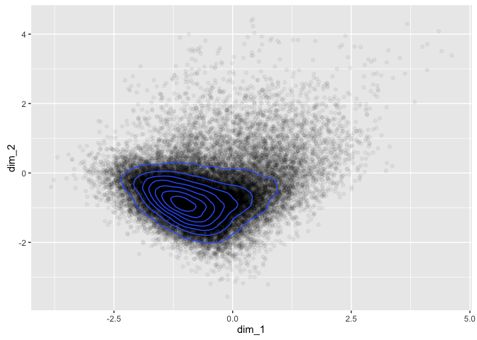
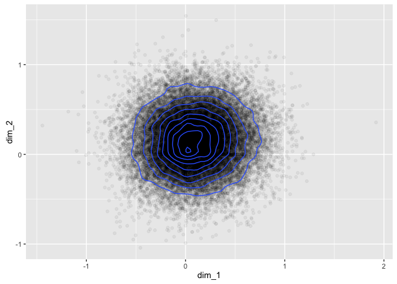

Proof of Concept - GloVe Distributions
================

This script aims to prove the following concepts:

-   The average GloVe position of words in a sentence is a meaningful way of representing the topic, theme or meaning of the sentence.
-   The distribution of these sentence-based GloVe positions can be approximated by a standard statistical distribution, and similar impact case studies should have significant overlap in their distributions.
-   Individual sentences which are outliers from the overall distribution can be identified programmatically.

Packages Required
-----------------

This script will use **text2vec** for the GloVe algorithm, **tibble** for use of the data\_frame, **stringr** for string operations, **tidytext** for managing the dataset, and **ggplot2** for plotting.

``` r
library(text2vec)
library(stringr)
library(tibble)
library(tidytext)
library(ggplot2)
```

Data Import and Tidy Text
-------------------------

The data has been downloaded previously using the **refimpact** package, and has been saved locally to speed up analysis. The `unnest_tokens()` function from the **tidytext** package is used to clean up the text and break it into sentences.

``` r
ref <- readRDS("~/ref_data.rds")
ref <- ref[,c("CaseStudyId", "UOA", "ImpactType",
              "Institution", "Title", "ImpactDetails")]
tidy_ref <- unnest_tokens(ref, text, ImpactDetails, "sentences")
glimpse(tidy_ref)
```

    ## Observations: 211,278
    ## Variables: 6
    ## $ CaseStudyId <chr> "100", "100", "100", "100", "100", "100", "100", "...
    ## $ UOA         <chr> "Architecture, Built Environment and Planning", "A...
    ## $ ImpactType  <chr> "Cultural", "Cultural", "Cultural", "Cultural", "C...
    ## $ Institution <chr> "\n    Nottingham\n          Trent University\n   ...
    ## $ Title       <chr> "\n    Managing heritage, designing futures: herit...
    ## $ text        <chr> "the historical, cultural, methodological and ethi...

GloVe
-----

GloVe is effectively a dimensionality reduction technique for bag-of-words text representation, where each word is mapped into a position in m-dimensional space based on its observed context in the corpus. Due to the importance of context, it needs to be trained on the original unbroken impact studies rather than the tidy text (which has been broken into sentences).

For the initial investigation of the nature of the distributions generated, the GloVe model will only use 2 dimensions. For the final model the number of dimensions will likely be 50.

``` r
prepare_text <- function(x) {
  x %>% 
  str_to_lower %>% 
  str_replace_all("[^[:alnum:]]", " ") %>% 
  str_replace_all("\\s+", " ")
}

glove_input <- prepare_text(ref$ImpactDetails)
tokens <- space_tokenizer(glove_input)
it <- itoken(tokens)
vocab <- create_vocabulary(it)
vocab <- prune_vocabulary(vocab, term_count_min = 5L)
vectorizer <- vocab_vectorizer(vocab, grow_dtm = FALSE, skip_grams_window = 5L)
tcm <- create_tcm(it, vectorizer)

glove <- GlobalVectors$new(word_vectors_size = 2,
                           vocabulary = vocab,
                           x_max = 10L,
                           #lambda = 1e-5,
                           shuffle=T)
glove$fit(tcm, n_iter = 50)

word_vectors <- glove$get_word_vectors()
```

This GloVe model has now mapped each word from the corpus into a two dimensional space where (in practice) related words are grouped together and the vector differences between points have meaning. The standard results published in the **word2vec** and **GloVe** papers are:

-   king - man + woman = queen
-   berlin - germany + italy = rome

We can take a look at some of these mappings by inspecting the word\_vectors data frame.

``` r
word_vectors[c("cat", "dog", "research", "impact"),]
```

    ##                [,1]        [,2]
    ## cat      -0.5180512 -0.01000066
    ## dog      -1.2433065 -0.03891423
    ## research  2.3732041 -3.88405359
    ## impact    2.0057199 -3.77422833

We can also look at how these words are distributed across the two dimensional space.

``` r
words <- as.data.frame(word_vectors)
names(words) <- c("dim_1", "dim_2")
ggplot(words) +
  geom_point(aes(x=dim_1, y=dim_2), alpha = 0.05) +
  geom_density2d(aes(x=dim_1, y=dim_2))
```



This is good! They sort of resemble a normal distribution with a bit of noise, and this may well improve as the dimensionality of the GloVe model increases. But why assume? We can test this by fitting a 50 dimensional GloVe model and then plotting any two dimensions (noting that all dimensions are equally important in GloVe, unlike other dimensionality reduction techniques like PCA).

``` r
glove2 <- GlobalVectors$new(word_vectors_size = 50,
                           vocabulary = vocab,
                           x_max = 10L,
                           #lambda = 1e-5,
                           shuffle=T)
glove2$fit(tcm, n_iter = 50)

word_vectors2 <- glove2$get_word_vectors()
words2 <- as.data.frame(word_vectors2[,c(1,2)])
names(words2) <- c("dim_1", "dim_2")
ggplot(words2) +
  geom_point(aes(x=dim_1, y=dim_2), alpha = 0.05) +
  geom_density2d(aes(x=dim_1, y=dim_2))
```



This looks like the assumption of multivariate normality might be okay! Woohoo! While we're here we might as well test it formally using the **MVN** package. The package doesn't seem to deal so well with large datasets, so we'll test normality with a sample.

``` r
library(MVN)
```

    ## sROC 0.1-2 loaded

``` r
mardiaTest(word_vectors2[sample(1:nrow(word_vectors2), 5000),])
```

    ##    Mardia's Multivariate Normality Test 
    ## --------------------------------------- 
    ##    data : word_vectors2[sample(1:nrow(word_vectors2), 5000), ] 
    ## 
    ##    g1p            : 49.64161 
    ##    chi.skew       : 41368.01 
    ##    p.value.skew   : 0 
    ## 
    ##    g2p            : 2708.41 
    ##    z.kurtosis     : 53.15227 
    ##    p.value.kurt   : 0 
    ## 
    ##    chi.small.skew : 41393.8 
    ##    p.value.small  : 0 
    ## 
    ##    Result          : Data are not multivariate normal. 
    ## ---------------------------------------

``` r
hzTest(word_vectors2[sample(1:nrow(word_vectors2), 5000),])
```

    ##   Henze-Zirkler's Multivariate Normality Test 
    ## --------------------------------------------- 
    ##   data : word_vectors2[sample(1:nrow(word_vectors2), 5000), ] 
    ## 
    ##   HZ      : 1.000101 
    ##   p-value : 0 
    ## 
    ##   Result  : Data are not multivariate normal. 
    ## ---------------------------------------------

``` r
roystonTest(word_vectors2[sample(1:nrow(word_vectors2), 2000),])
```

    ##   Royston's Multivariate Normality Test 
    ## --------------------------------------------- 
    ##   data : word_vectors2[sample(1:nrow(word_vectors2), 2000), ] 
    ## 
    ##   H       : 179.0934 
    ##   p-value : 1.992077e-16 
    ## 
    ##   Result  : Data are not multivariate normal. 
    ## ---------------------------------------------

These are all pretty resounding "no" results from the formal tests, however it is quite hard to find a large, 50-dimensional dataset for which the multivariate normality assumption holds. The important thing is that we can use the almost-multivariate-normal assumption to find outliers, but this won't be necessary until we're looking at whole sentences.

Before we move on, we might as well check that similar words are near each other, and different words are far apart. We can do this visually using the 2 dimensional GloVe model.

``` r
word_vectors[c("kidney", "liver", "institute", "university"),]
```

    ##                  [,1]       [,2]
    ## kidney     -1.3393464 -0.4400932
    ## liver      -1.0516277 -0.2263514
    ## institute   0.2867716 -1.5994302
    ## university  2.2799035 -1.3602230

It looks like it works pretty well, even in 2 dimensions! To be extra certain we can look at the euclidian distances between the words in the 50 dimensional GloVe model.

``` r
dist(word_vectors2[c("kidney", "liver", "institute", "university"),],
     method = "euclidian")
```

    ##              kidney    liver institute
    ## liver      3.943530                   
    ## institute  5.380191 5.360952          
    ## university 7.064157 7.207583  5.117141

This is as expected - kidney and liver are the closest two words, then institute and university are the next closest pairing. The 50-dimensonal representation is doing a reasonable job of separating out the words.

GloVe Representation of Sentences
---------------------------------

To be continued...
