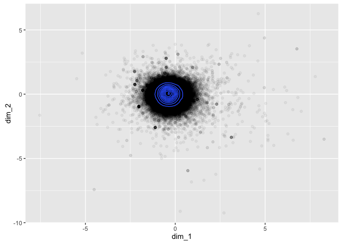
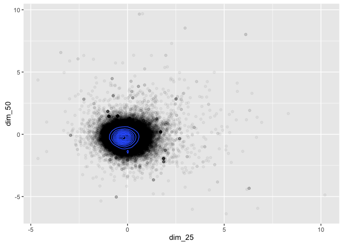

Proof of Concept - GloVe Distributions
================

This script aims to prove the following concepts:

-   The average GloVe position of words in a sentence is a meaningful way of representing the topic, theme or meaning of the sentence.
-   The distribution of these sentence-based GloVe positions can be approximated by a standard statistical distribution, and similar impact case studies should have significant overlap in their distributions.
-   Individual sentences which are outliers from the overall distribution can be identified programmatically.

Packages Required
-----------------

This script will use **text2vec** for the GloVe algorithm, **tibble** for use of the data\_frame, **stringr** for string operations, **tidytext** for managing the dataset, and **ggplot2** for plotting.

``` r
library(text2vec)
library(stringr)
library(tibble)
library(tidytext)
library(ggplot2)
```

Data Import and Tidy Text
-------------------------

The data has been downloaded previously using the **refimpact** package, and has been saved locally to speed up analysis. The `unnest_tokens()` function from the **tidytext** package is used to clean up the text and break it into sentences.

``` r
ref <- readRDS("~/ref_data.rds")
ref <- ref[,c("CaseStudyId", "UOA", "ImpactType",
              "Institution", "Title", "ImpactDetails")]
tidy_ref <- unnest_tokens(ref, text, ImpactDetails, "sentences")
glimpse(tidy_ref)
```

    ## Observations: 211,278
    ## Variables: 6
    ## $ CaseStudyId <chr> "100", "100", "100", "100", "100", "100", "100", "...
    ## $ UOA         <chr> "Architecture, Built Environment and Planning", "A...
    ## $ ImpactType  <chr> "Cultural", "Cultural", "Cultural", "Cultural", "C...
    ## $ Institution <chr> "\n    Nottingham\n          Trent University\n   ...
    ## $ Title       <chr> "\n    Managing heritage, designing futures: herit...
    ## $ text        <chr> "the historical, cultural, methodological and ethi...

GloVe
-----

GloVe is effectively a dimensionality reduction technique for bag-of-words text representation, where each word is mapped into a position in m-dimensional space based on its observed context in the corpus. Due to the importance of context, it needs to be trained on the original unbroken impact studies rather than the tidy text (which has been broken into sentences).

For the initial investigation of the nature of the distributions generated, the GloVe model will only use 2 dimensions. For the final model the number of dimensions will likely be 50.

``` r
prepare_text <- function(x) {
  x %>% 
  str_to_lower %>% 
  str_replace_all("[^[:alnum:]]", " ") %>% 
  str_replace_all("\\s+", " ")
}

glove_input <- prepare_text(ref$ImpactDetails)
tokens <- word_tokenizer(glove_input)
it <- itoken(tokens)
vocab <- create_vocabulary(it)
vocab <- prune_vocabulary(vocab, term_count_min = 5L)
vectorizer <- vocab_vectorizer(vocab, grow_dtm = FALSE, skip_grams_window = 5L)
tcm <- create_tcm(it, vectorizer)

glove <- GlobalVectors$new(word_vectors_size = 2,
                           vocabulary = vocab,
                           x_max = 10L,
                           #lambda = 1e-5,
                           shuffle=T)
glove$fit(tcm, n_iter = 50)

word_vectors <- glove$get_word_vectors()
```

This GloVe model has now mapped each word from the corpus into a two dimensional space where (in practice) related words are grouped together and the vector differences between points have meaning. The standard results published in the **word2vec** and **GloVe** papers are:

-   king - man + woman = queen
-   berlin - germany + italy = rome

We can take a look at some of these mappings by inspecting the word\_vectors data frame.

``` r
word_vectors[c("cat", "dog", "research", "impact"),]
```

    ##                [,1]        [,2]
    ## cat       0.6441788  0.05966694
    ## dog       1.4972423  0.18532640
    ## research -1.2071247 -4.43754125
    ## impact   -0.7722179 -4.21917439

We can also look at how these words are distributed across the two dimensional space.

``` r
words <- as.data.frame(word_vectors)
names(words) <- c("dim_1", "dim_2")
ggplot(words) +
  geom_point(aes(x=dim_1, y=dim_2), alpha = 0.05) +
  geom_density2d(aes(x=dim_1, y=dim_2))
```


This is good! They sort of resemble a normal distribution with a bit of noise, and this may well improve as the dimensionality of the GloVe model increases. But why assume? We can test this by fitting a 50 dimensional GloVe model and then plotting any two dimensions (noting that all dimensions are equally important in GloVe, unlike other dimensionality reduction techniques like PCA).

``` r
glove2 <- GlobalVectors$new(word_vectors_size = 50,
                           vocabulary = vocab,
                           x_max = 10L,
                           lambda = 1e-5,
                           shuffle=T)
glove2$fit(tcm, n_iter = 50)

word_vectors2 <- glove2$get_word_vectors()
words2 <- as.data.frame(word_vectors2[,c(1,2)])
names(words2) <- c("dim_1", "dim_2")
ggplot(words2) +
  geom_point(aes(x=dim_1, y=dim_2), alpha = 0.05) +
  geom_density2d(aes(x=dim_1, y=dim_2))
```


This looks like the assumption of multivariate normality might be okay! Woohoo! While we're here we might as well test it formally using the **MVN** package. The package doesn't seem to deal so well with large datasets, so we'll test normality with a sample.

``` r
library(MVN)
```

    ## sROC 0.1-2 loaded

``` r
mardiaTest(word_vectors2[sample(1:nrow(word_vectors2), 5000),])
```

    ##    Mardia's Multivariate Normality Test 
    ## --------------------------------------- 
    ##    data : word_vectors2[sample(1:nrow(word_vectors2), 5000), ] 
    ## 
    ##    g1p            : 45.07171 
    ##    chi.skew       : 37559.76 
    ##    p.value.skew   : 0 
    ## 
    ##    g2p            : 2701.326 
    ##    z.kurtosis     : 49.67892 
    ##    p.value.kurt   : 0 
    ## 
    ##    chi.small.skew : 37583.18 
    ##    p.value.small  : 0 
    ## 
    ##    Result          : Data are not multivariate normal. 
    ## ---------------------------------------

``` r
hzTest(word_vectors2[sample(1:nrow(word_vectors2), 5000),])
```

    ##   Henze-Zirkler's Multivariate Normality Test 
    ## --------------------------------------------- 
    ##   data : word_vectors2[sample(1:nrow(word_vectors2), 5000), ] 
    ## 
    ##   HZ      : 1.000221 
    ##   p-value : 0 
    ## 
    ##   Result  : Data are not multivariate normal. 
    ## ---------------------------------------------

``` r
roystonTest(word_vectors2[sample(1:nrow(word_vectors2), 2000),])
```

    ##   Royston's Multivariate Normality Test 
    ## --------------------------------------------- 
    ##   data : word_vectors2[sample(1:nrow(word_vectors2), 2000), ] 
    ## 
    ##   H       : 196.0446 
    ##   p-value : 3.533865e-19 
    ## 
    ##   Result  : Data are not multivariate normal. 
    ## ---------------------------------------------

These are all pretty resounding "no" results from the formal tests, however it is quite hard to find a large, 50-dimensional dataset for which the multivariate normality assumption holds. The important thing is that we can use the almost-multivariate-normal assumption to find outliers, but this won't be necessary until we're looking at whole sentences.

Before we move on, we might as well check that similar words are near each other, and different words are far apart. We can do this visually using the 2 dimensional GloVe model.

``` r
word_vectors[c("kidney", "bladder", "institute", "university"),]
```

    ##                  [,1]      [,2]
    ## kidney      1.8903863 -0.241259
    ## bladder     2.2078429  0.251237
    ## institute   0.7059176 -1.811910
    ## university -1.4081683 -2.165120

It looks like it works pretty well, even in 2 dimensions! To be extra certain we can look at similar words in the 50 dimensional GloVe model.

``` r
get_nearest <- function(x) {
  sim2(x = word_vectors2, y = word_vectors2[x,,drop=F], 
       method = "cosine", norm = "l2")[,1] %>% 
    sort(decreasing = TRUE) %>% head(5)
}
get_nearest("kidney")
```

    ##      kidney  transplant     chronic       atlas respiratory 
    ##   1.0000000   0.6421675   0.6406666   0.5908269   0.5707309

``` r
get_nearest("bladder")
```

    ##   bladder      skin      aqua    rectal steroidal 
    ## 1.0000000 0.5694836 0.5563676 0.5470283 0.5400433

``` r
get_nearest("institute")
```

    ##   institute  department     academy     british association 
    ##   1.0000000   0.6268260   0.5962060   0.5869160   0.5841652

``` r
get_nearest("university")
```

    ## university     oxford  cambridge    bristol    glasgow 
    ##  1.0000000  0.7785064  0.7569955  0.7390735  0.7155197

This is looking promising - similar words are near each other in the 50D representation, which suggests it is doing a reasonable job of separating out the words.

The final thing we can do to assess the GloVe representation is to test the word relationships using a standard test set. This is unlikely to perform very well on this dataset as it is quite specific, however it should provide a reasonable basis for comparison when tuning the GloVe model later in the project.

``` r
questions_file <- '~/impactface/Data/questions-words.txt'
qlst <- prepare_analogy_questions(questions_file,
                                  rownames(word_vectors2),
                                  verbose = T)
```

    ## 2016-10-12 23:03:51 -  9018 full questions found out of 19544 total

``` r
res <- check_analogy_accuracy(questions_list = qlst, 
                              m_word_vectors = word_vectors2,
                              verbose = T)
```

    ## 2016-10-12 23:03:53 - capital-common-countries: correct 61 out of 506, accuracy = 0.1206

    ## 2016-10-12 23:03:56 - capital-world: correct 71 out of 1638, accuracy = 0.0433

    ## 2016-10-12 23:03:56 - currency: correct 0 out of 40, accuracy = 0.0000

    ## 2016-10-12 23:03:57 - city-in-state: correct 11 out of 449, accuracy = 0.0245

    ## 2016-10-12 23:03:57 - family: correct 21 out of 182, accuracy = 0.1154

    ## 2016-10-12 23:03:58 - gram1-adjective-to-adverb: correct 4 out of 506, accuracy = 0.0079

    ## 2016-10-12 23:03:59 - gram2-opposite: correct 0 out of 240, accuracy = 0.0000

    ## 2016-10-12 23:04:01 - gram3-comparative: correct 72 out of 930, accuracy = 0.0774

    ## 2016-10-12 23:04:01 - gram4-superlative: correct 8 out of 210, accuracy = 0.0381

    ## 2016-10-12 23:04:03 - gram5-present-participle: correct 46 out of 870, accuracy = 0.0529

    ## 2016-10-12 23:04:06 - gram6-nationality-adjective: correct 54 out of 1299, accuracy = 0.0416

    ## 2016-10-12 23:04:08 - gram7-past-tense: correct 69 out of 992, accuracy = 0.0696

    ## 2016-10-12 23:04:09 - gram8-plural: correct 2 out of 650, accuracy = 0.0031

    ## 2016-10-12 23:04:10 - gram9-plural-verbs: correct 40 out of 506, accuracy = 0.0791

    ## 2016-10-12 23:04:10 - OVERALL ACCURACY = 0.0509

The overall accuracy isn't hugely important in this context, and it will be improved upon when the model is tuned.

GloVe Representation of Sentences
---------------------------------

There is currently no universally accepted method for combining GloVe (or word2vec) vectors into sentences. Some approaches involve training a new model to look at sentence context, however this requires significantly more training data than I have access to. Other approaches include either:

1.  taking the average vector for each of the words in the sentence, or
2.  applying the tf-idf weighted average vector for each of the words in the sentence.

Given that the second option should up-weight important words and down-weight unimportant words, it seems like a good option. We can implement this by constructing a document-term matrix (DTM) and then multiplying the matrices together.

``` r
tokens <- word_tokenizer(tidy_ref$text)
it <- itoken(tokens)
# use vocab from last GloVe model
vectorizer <- vocab_vectorizer(vocab)
dtm <- create_dtm(it, vectorizer)
tfidf <- TfIdf$new()
dtm_tfidf <- fit_transform(dtm, tfidf)
sentence_vectors <- dtm_tfidf %*% word_vectors2
```

I have to admit I'm a little surprised that worked; I was expecting that step to be a lot harder! The next step is to revisit the multivariate normality assumption with this new data. There is a heap more of it (as there are more sentences in the corpus than words in the vocabulary) so the formal tests will definitely not be satisfied, but **ggplot2** should still be able to handle the full dataset.

``` r
sen_plot <- as.data.frame(as.matrix(sentence_vectors[,c(1,2,25,50)]))
names(sen_plot) <- c("dim_1", "dim_2", "dim_25", "dim_50")
ggplot(sen_plot) +
  geom_point(aes(x=dim_1, y=dim_2), alpha = 0.05) +
  geom_density2d(aes(x=dim_1, y=dim_2))
```



``` r
ggplot(sen_plot) +
  geom_point(aes(x=dim_25, y=dim_50), alpha = 0.05) +
  geom_density2d(aes(x=dim_25, y=dim_50))
```



These plots look close enough to multvariate normal for the purpose of this project, so I think we can call that a win for now. The next thing to do is check whether the position of these sentences in the GloVe vector space has any meaning. First we need to set up the similarity function, which will give (in order):

1.  the sentence being compared
2.  the nearest sentence
3.  the second-nearest sentence
4.  the furthest sentence
5.  the second-furthest sentence

``` r
dimnames(sentence_vectors) <- 
  list(str_replace_all(tidy_ref$text,"\\s+", " ") , NULL)
get_nearest_and_farthest <- function(x, vecs) {
  vecs <- as.matrix(vecs)
  sim_vec <- sim2(x = vecs, y = vecs[x,,drop=F], 
                  method = "cosine", norm = "l2")[,1] %>% 
               sort(decreasing = TRUE)
  out <- c(head(sim_vec,3),tail(sim_vec,2))
  out
}
```

We can now see if similar sentences are being discovered by the model - here goes nothing!

``` r
get_nearest_and_farthest(1, sentence_vectors)
```

    ## the historical, cultural, methodological and ethical insights from the research and outputs have resulted in pioneering, wide-ranging and sustained impact from ntu's leading involvement and advisory role in a number of impactful projects in the documentation, management and renewal of built heritage in oman and the uae and its dissemination through public engagement. 
    ##                                                                                                                                                                                                                                                                                                                                                                         1.0000000 
    ##                                                                         the significant impact of the research projects has been recognised in terms of the contribution to cultural enrichment, the discussion of sites of national heritage and engagement of public in moral and ethical issues arising from new scientific developments and the transparency of closed sites. 
    ##                                                                                                                                                                                                                                                                                                                                                                         0.8979744 
    ##                                                                                     pathways: taken together, the impacts documented below have developed with respect to uom's reputation as a centre of research excellence in the area of class and cultural participation, resulting in a series of collaborative research relationships and consultancies with stakeholders. 
    ##                                                                                                                                                                                                                                                                                                                                                                         0.8886134 
    ##                                                                                                                                                                                                                                                                                                                                                 figure courtesy of bfn and ospar. 
    ##                                                                                                                                                                                                                                                                                                                                                                        -0.5639160 
    ##                                                                                                                                                                                   the international subarachnoid aneurysm trial (isat) was the first of its kind to compare neurosurgical clipping and endovascular coiling for patients suffering from subarachnoid haemorrhage. 
    ##                                                                                                                                                                                                                                                                                                                                                                        -0.5853312

``` r
get_nearest_and_farthest(1234, sentence_vectors)
```

    ##                                                                                                                                                                                                                                                                                                                                                                                                                                                                                                                                                                                      policy the uk`s cabinet office, and office of the prime minister, invited varese to join the strategic review of serious organized crime, in 2009, because his work had come to the attention of the chairman of soca [section 5: c1]. 
    ##                                                                                                                                                                                                                                                                                                                                                                                                                                                                                                                                                                                                                                                                                                                                                                                                                   1.0000000 
    ##                                                                                                                                                                                                                                                                                                                                                                                                                                                                                                                                                                                                             following this meeting, dr mihir shah, member of the indian government's planning commission with responsibility for water, requested that cullet contribute a law section to the discussion paper in question. 
    ##                                                                                                                                                                                                                                                                                                                                                                                                                                                                                                                                                                                                                                                                                                                                                                                                                   0.8892530 
    ## the appccg chair mr colin challen mp was shortly afterwards granted a private meeting about the report and its contents with the then prime minister, tony blair.5.2 responding directly to recommendation 12 of the appccg report &#8212; which had not been previously proposed in the labour government's 2005 manifesto &#8212; the government brought forward proposals in the 2006 queen's speech for what became the climate change act, which at its core had the establishment of the uk climate change committee (ukccc), an independent non-departmental public body of climate scientists and economists mandated to recommend uk climate targets and monitor progress towards them.5.2, 5.3, 5.4 establishment of the uk climate change committee the climate change act was passed into law in november 2008. 
    ##                                                                                                                                                                                                                                                                                                                                                                                                                                                                                                                                                                                                                                                                                                                                                                                                                   0.8879330 
    ##                                                                                                                                                                                                                                                                                                                                                                                                                                                                                                                                                                                                                                                                                                                                   these were based on a patterned ito electrode, connector-device and encapsulation system. 
    ##                                                                                                                                                                                                                                                                                                                                                                                                                                                                                                                                                                                                                                                                                                                                                                                                                  -0.5620864 
    ##                                                                                                                                                                                                                                                                                                                                                                                                                                                                                                                                                                                                                                                                 here, the products target particularly aubergine, cucumber, melon, pepper, blueberry, raspberry, strawberry, tomato, cut flowers and ornamental pot plants. 
    ##                                                                                                                                                                                                                                                                                                                                                                                                                                                                                                                                                                                                                                                                                                                                                                                                                  -0.5674509

``` r
get_nearest_and_farthest(5678, sentence_vectors)
```

    ##                                                                                             the two handbooks have had 2894 views since 2011. 
    ##                                                                                                                                     1.0000000 
    ##                                             from july 2010 to july 2013, presentations and briefings have been made on 14 separate occasions. 
    ##                                                                                                                                     0.8197176 
    ##                                               this has been on sale since october 2009 and over 30 installations have been carried out [4.2]. 
    ##                                                                                                                                     0.8191136 
    ##                                                                                     (amos bertolacci, scuola normale superiore, pisa, italy). 
    ##                                                                                                                                    -0.5295576 
    ## this csip-cefas underpinning research utilises a sentinel marine mammal apex predator - the uk-stranded harbour porpoise (phocoena phocoena). 
    ##                                                                                                                                    -0.5607831

``` r
get_nearest_and_farthest(9999, sentence_vectors)
```

    ##                                                                                                                                                   additionally, the changes have benefited patients who required fewer attendances and no splint in the majority of cases, without compromise to outcomes". 
    ##                                                                                                                                                                                                                                                                                                   1.0000000 
    ## at great ormond street hospital and uclh there are currently 21 children and adolescent patients being treated with tocilizumab who would otherwise have had active disease with its potential problems and most likely would have been on high dose steroids and suffering the complications of this also. 
    ##                                                                                                                                                                                                                                                                                                   0.7802381 
    ##                                                                                                                                                                                                    patients carrying the specific genetic markers had a higher remission compared to those who did not [f]. 
    ##                                                                                                                                                                                                                                                                                                   0.7785287 
    ##                                                                                                                                                                                                              the members of this consortium include intel, micron, samsung, sandisk, sk hynix, and toshiba. 
    ##                                                                                                                                                                                                                                                                                                  -0.4710758 
    ##                                                                                                                                                                                                                                              barack obama and the liberal news media', in the conversation. 
    ##                                                                                                                                                                                                                                                                                                  -0.4796429

I don't want to get too carried away here, but it looks like it's working! The first three sentences in each comparison are similar, and the last two are very dissimilar! I'm going to claim that as a win for now, and I'm comfortable that the first assumption under test in this script is viable.
