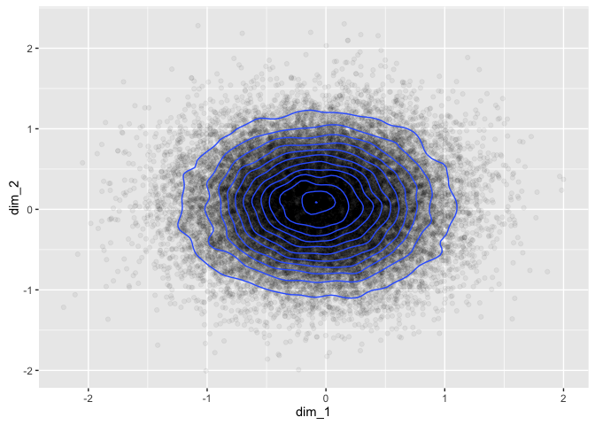
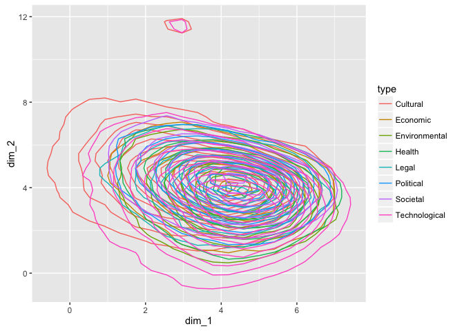
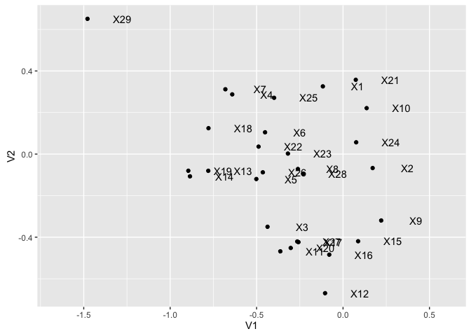

Proof of Concept - GloVe Distributions
================

This script aims to prove the following concepts:

1.  The average GloVe position of words in a sentence is a meaningful way of representing the topic, theme or meaning of the sentence.
2.  The distribution of these sentence-based GloVe positions can be approximated by a standard statistical distribution, and similar impact case studies should have significant overlap in their distributions.
3.  Individual sentences which are outliers from the overall distribution can be identified programmatically.

Packages Required
-----------------

This script will use **text2vec** for the GloVe algorithm, **tibble** for use of the data\_frame, **stringr** for string operations, **tidytext** for managing the dataset, **dplyr** for data manipulation and **ggplot2** for plotting.

``` r
library(text2vec)
library(stringr)
library(tibble)
library(tidytext)
library(dplyr)
library(ggplot2)
```

Data Import and Tidy Text
-------------------------

The data has been downloaded previously using the **refimpact** package, and has been saved locally to speed up analysis. The `unnest_tokens()` function from the **tidytext** package is used to clean up the text and break it into sentences.

``` r
ref <- readRDS("~/ref_data.rds")
ref <- ref[,c("CaseStudyId", "UOA", "ImpactType",
              "Institution", "Title", "ImpactDetails")]
tidy_ref <- unnest_tokens(ref, text, ImpactDetails, "sentences")
glimpse(tidy_ref)
```

    ## Observations: 211,278
    ## Variables: 6
    ## $ CaseStudyId <chr> "100", "100", "100", "100", "100", "100", "100", "...
    ## $ UOA         <chr> "Architecture, Built Environment and Planning", "A...
    ## $ ImpactType  <chr> "Cultural", "Cultural", "Cultural", "Cultural", "C...
    ## $ Institution <chr> "\n    Nottingham\n          Trent University\n   ...
    ## $ Title       <chr> "\n    Managing heritage, designing futures: herit...
    ## $ text        <chr> "the historical, cultural, methodological and ethi...

GloVe
-----

GloVe is effectively a dimensionality reduction technique for bag-of-words text representation, where each word is mapped into a position in m-dimensional space based on its observed context in the corpus. Due to the importance of context, it needs to be trained on the original unbroken impact studies rather than the tidy text (which has been broken into sentences).

For the initial investigation of the nature of the distributions generated, the GloVe model will only use 2 dimensions. For the final model the number of dimensions will likely be 50.

``` r
prepare_text <- function(x) {
  x %>% 
  str_to_lower %>% 
  str_replace_all("[^[:alnum:]]", " ") %>% 
  str_replace_all("\\s+", " ")
}

glove_input <- prepare_text(ref$ImpactDetails)
tokens <- word_tokenizer(glove_input)
it <- itoken(tokens)
vocab <- create_vocabulary(it)
vocab <- prune_vocabulary(vocab, term_count_min = 5L)
vectorizer <- vocab_vectorizer(vocab, grow_dtm = FALSE, skip_grams_window = 5L)
tcm <- create_tcm(it, vectorizer)

glove <- GlobalVectors$new(word_vectors_size = 2,
                           vocabulary = vocab,
                           x_max = 10L,
                           #lambda = 1e-5,
                           shuffle=T)
glove$fit(tcm, n_iter = 50)

word_vectors <- glove$get_word_vectors()
```

This GloVe model has now mapped each word from the corpus into a two dimensional space where (in practice) related words are grouped together and the vector differences between points have meaning. The standard results published in the **word2vec** and **GloVe** papers are:

-   king - man + woman = queen
-   berlin - germany + italy = rome

We can take a look at some of these mappings by inspecting the word\_vectors data frame.

``` r
word_vectors[c("cat", "dog", "research", "impact"),]
```

    ##                  [,1]       [,2]
    ## cat      -0.001322268 -0.4340778
    ## dog       0.164832056 -1.4152933
    ## research  4.040392876  2.0768546
    ## impact    3.432395339  2.4401799

We can also look at how these words are distributed across the two dimensional space.

``` r
words <- as.data.frame(word_vectors)
names(words) <- c("dim_1", "dim_2")
ggplot(words) +
  geom_point(aes(x=dim_1, y=dim_2), alpha = 0.05) +
  geom_density2d(aes(x=dim_1, y=dim_2))
```


This is good! They sort of resemble a normal distribution with a bit of noise, and this may well improve as the dimensionality of the GloVe model increases. But why assume? We can test this by fitting a 50 dimensional GloVe model and then plotting any two dimensions (noting that all dimensions are equally important in GloVe, unlike other dimensionality reduction techniques like PCA).

``` r
glove2 <- GlobalVectors$new(word_vectors_size = 50,
                           vocabulary = vocab,
                           x_max = 10L,
                           lambda = 1e-5,
                           shuffle=T)
glove2$fit(tcm, n_iter = 50)

word_vectors2 <- glove2$get_word_vectors()
words2 <- as.data.frame(word_vectors2[,c(1,2)])
names(words2) <- c("dim_1", "dim_2")
ggplot(words2) +
  geom_point(aes(x=dim_1, y=dim_2), alpha = 0.05) +
  geom_density2d(aes(x=dim_1, y=dim_2))
```


This looks like the assumption of multivariate normality might be okay! Woohoo! While we're here we might as well test it formally using the **MVN** package. The package doesn't seem to deal so well with large datasets, so we'll test normality with a sample.

``` r
library(MVN)
```

    ## sROC 0.1-2 loaded

``` r
mardiaTest(word_vectors2[sample(1:nrow(word_vectors2), 5000),])
```

    ##    Mardia's Multivariate Normality Test 
    ## --------------------------------------- 
    ##    data : word_vectors2[sample(1:nrow(word_vectors2), 5000), ] 
    ## 
    ##    g1p            : 45.83913 
    ##    chi.skew       : 38199.27 
    ##    p.value.skew   : 0 
    ## 
    ##    g2p            : 2699.26 
    ##    z.kurtosis     : 48.66621 
    ##    p.value.kurt   : 0 
    ## 
    ##    chi.small.skew : 38223.09 
    ##    p.value.small  : 0 
    ## 
    ##    Result          : Data are not multivariate normal. 
    ## ---------------------------------------

``` r
hzTest(word_vectors2[sample(1:nrow(word_vectors2), 5000),])
```

    ##   Henze-Zirkler's Multivariate Normality Test 
    ## --------------------------------------------- 
    ##   data : word_vectors2[sample(1:nrow(word_vectors2), 5000), ] 
    ## 
    ##   HZ      : 1.000343 
    ##   p-value : 0 
    ## 
    ##   Result  : Data are not multivariate normal. 
    ## ---------------------------------------------

``` r
roystonTest(word_vectors2[sample(1:nrow(word_vectors2), 2000),])
```

    ##   Royston's Multivariate Normality Test 
    ## --------------------------------------------- 
    ##   data : word_vectors2[sample(1:nrow(word_vectors2), 2000), ] 
    ## 
    ##   H       : 169.3959 
    ##   p-value : 6.824157e-15 
    ## 
    ##   Result  : Data are not multivariate normal. 
    ## ---------------------------------------------

These are all pretty resounding "no" results from the formal tests, however it is quite hard to find a large, 50-dimensional dataset for which the multivariate normality assumption holds. The important thing is that we can use the almost-multivariate-normal assumption to find outliers, but this won't be necessary until we're looking at whole sentences.

Before we move on, we might as well check that similar words are near each other, and different words are far apart. We can do this visually using the 2 dimensional GloVe model.

``` r
word_vectors[c("kidney", "bladder", "institute", "university"),]
```

    ##                 [,1]       [,2]
    ## kidney     0.6172394 -1.5871525
    ## bladder    0.2802327 -2.0158139
    ## institute  2.7051886 -0.8741831
    ## university 2.9325219  0.1342112

It looks like it works pretty well, even in 2 dimensions! To be extra certain we can look at similar words in the 50 dimensional GloVe model.

``` r
get_nearest <- function(x) {
  sim2(x = word_vectors2, y = word_vectors2[x,,drop=F], 
       method = "cosine", norm = "l2")[,1] %>% 
    sort(decreasing = TRUE) %>% head(5)
}
get_nearest("kidney")
```

    ##      kidney     chronic  transplant       renal respiratory 
    ##   1.0000000   0.6215615   0.6055849   0.5593449   0.5577383

``` r
get_nearest("bladder")
```

    ##    bladder     rectal   invasive     ransom ultrasonic 
    ##  1.0000000  0.6231641  0.6054690  0.5773150  0.5704454

``` r
get_nearest("institute")
```

    ##  institute    academy    british department australian 
    ##  1.0000000  0.6276094  0.6224353  0.6005017  0.5877603

``` r
get_nearest("university")
```

    ## university  cambridge     oxford    glasgow    cardiff 
    ##  1.0000000  0.7508616  0.7495244  0.7234860  0.7208967

This is looking promising - similar words are near each other in the 50D representation, which suggests it is doing a reasonable job of separating out the words.

The final thing we can do to assess the GloVe representation is to test the word relationships using a standard test set. This is unlikely to perform very well on this dataset as it is quite specific, however it should provide a reasonable basis for comparison when tuning the GloVe model later in the project.

``` r
questions_file <- '~/impactface/Data/questions-words.txt'
qlst <- prepare_analogy_questions(questions_file,
                                  rownames(word_vectors2),
                                  verbose = T)
```

    ## 2016-10-13 23:41:30 -  9018 full questions found out of 19544 total

``` r
res <- check_analogy_accuracy(questions_list = qlst, 
                              m_word_vectors = word_vectors2,
                              verbose = T)
```

    ## 2016-10-13 23:41:31 - capital-common-countries: correct 63 out of 506, accuracy = 0.1245

    ## 2016-10-13 23:41:35 - capital-world: correct 61 out of 1638, accuracy = 0.0372

    ## 2016-10-13 23:41:35 - currency: correct 0 out of 40, accuracy = 0.0000

    ## 2016-10-13 23:41:35 - city-in-state: correct 11 out of 449, accuracy = 0.0245

    ## 2016-10-13 23:41:36 - family: correct 22 out of 182, accuracy = 0.1209

    ## 2016-10-13 23:41:37 - gram1-adjective-to-adverb: correct 3 out of 506, accuracy = 0.0059

    ## 2016-10-13 23:41:37 - gram2-opposite: correct 0 out of 240, accuracy = 0.0000

    ## 2016-10-13 23:41:39 - gram3-comparative: correct 70 out of 930, accuracy = 0.0753

    ## 2016-10-13 23:41:39 - gram4-superlative: correct 9 out of 210, accuracy = 0.0429

    ## 2016-10-13 23:41:41 - gram5-present-participle: correct 44 out of 870, accuracy = 0.0506

    ## 2016-10-13 23:41:43 - gram6-nationality-adjective: correct 74 out of 1299, accuracy = 0.0570

    ## 2016-10-13 23:41:45 - gram7-past-tense: correct 74 out of 992, accuracy = 0.0746

    ## 2016-10-13 23:41:46 - gram8-plural: correct 5 out of 650, accuracy = 0.0077

    ## 2016-10-13 23:41:47 - gram9-plural-verbs: correct 34 out of 506, accuracy = 0.0672

    ## 2016-10-13 23:41:47 - OVERALL ACCURACY = 0.0521

The overall accuracy isn't hugely important in this context, and it will be improved upon when the model is tuned.

GloVe Representation of Sentences
---------------------------------

There is currently no universally accepted method for combining GloVe (or word2vec) vectors into sentences. Some approaches involve training a new model to look at sentence context, however this requires significantly more training data than I have access to. Other approaches include either:

1.  taking the average vector for each of the words in the sentence, or
2.  applying the tf-idf weighted vector for each of the words in the sentence and
3.  taking the sum
4.  taking the average

Given that the second option should up-weight important words and down-weight unimportant words, it seems like a good option. We can implement this by constructing a document-term matrix (DTM) and then multiplying the matrices together. For now I will use the summation approach, and revisit the average approach later (in the a separate tuning document).

``` r
tokens <- word_tokenizer(tidy_ref$text)
it <- itoken(tokens)
# use vocab from last GloVe model
vectorizer <- vocab_vectorizer(vocab)
dtm <- create_dtm(it, vectorizer)
tfidf <- TfIdf$new()
dtm_tfidf <- fit_transform(dtm, tfidf)
sentence_vectors <- dtm_tfidf %*% word_vectors2
```

I have to admit I'm a little surprised that worked; I was expecting that step to be a lot harder! The next step is to revisit the multivariate normality assumption with this new data. There is a heap more of it (as there are more sentences in the corpus than words in the vocabulary) so the formal tests will definitely not be satisfied, but **ggplot2** should still be able to handle the full dataset.

``` r
sen_plot <- as.data.frame(as.matrix(sentence_vectors[,c(1,2,25,50)]))
names(sen_plot) <- c("dim_1", "dim_2", "dim_25", "dim_50")
ggplot(sen_plot) +
  geom_point(aes(x=dim_1, y=dim_2), alpha = 0.05) +
  geom_density2d(aes(x=dim_1, y=dim_2))
```


``` r
ggplot(sen_plot) +
  geom_point(aes(x=dim_25, y=dim_50), alpha = 0.05) +
  geom_density2d(aes(x=dim_25, y=dim_50))
```


These plots look close enough to multvariate normal for the purpose of this project, so I think we can call that a win for now. The next thing to do is check whether the position of these sentences in the GloVe vector space has any meaning. First we need to set up the similarity function, which will give (in order):

1.  the sentence being compared
2.  the nearest sentence
3.  the second-nearest sentence
4.  the furthest sentence
5.  the second-furthest sentence

``` r
dimnames(sentence_vectors) <- 
  list(str_replace_all(tidy_ref$text,"\\s+", " ") , NULL)
get_nearest_and_farthest <- function(x, vecs) {
  vecs <- as.matrix(vecs)
  sim_vec <- sim2(x = vecs, y = vecs[x,,drop=F], 
                  method = "cosine", norm = "l2")[,1] %>% 
               sort(decreasing = TRUE)
  out <- c(head(sim_vec,3),tail(sim_vec,2))
  out
}
```

We can now see if similar sentences are being discovered by the model - here goes nothing!

``` r
get_nearest_and_farthest(1, sentence_vectors)
```

    ##                                                                                                                                                                                                                                                                               the historical, cultural, methodological and ethical insights from the research and outputs have resulted in pioneering, wide-ranging and sustained impact from ntu's leading involvement and advisory role in a number of impactful projects in the documentation, management and renewal of built heritage in oman and the uae and its dissemination through public engagement. 
    ##                                                                                                                                                                                                                                                                                                                                                                                                                                                                                                                                                                                                                                                       1.0000000 
    ##                                                                                                                                                                                                                                                                                                                                                       the significant impact of the research projects has been recognised in terms of the contribution to cultural enrichment, the discussion of sites of national heritage and engagement of public in moral and ethical issues arising from new scientific developments and the transparency of closed sites. 
    ##                                                                                                                                                                                                                                                                                                                                                                                                                                                                                                                                                                                                                                                       0.9005569 
    ##                                                                                                                                                                                                                                                                                             through knowledge transfer and a deliberate policy of public engagement, the team has managed to engage with the following impact types: impact on practitioners and professional services: the seals project has created and interpreted cultural capital, through the team's work in gathering material in relation to medieval seals and disseminating the same. 
    ##                                                                                                                                                                                                                                                                                                                                                                                                                                                                                                                                                                                                                                                       0.8901973 
    ## the rota season (attendance 3,272) (5.10) showcased sixteen movies with scores by rota, including visconti's white nights (1957), the leopard (1963) and rocco and his brothers (1960), fellini's i vitelloni (1953), la strada (1954), il bidone (1955), nights of cabiria (1956), la dolce vita (1960), eight and a half (1963) and amarcord (1973), as well as popular italian comedies (&#200; primavera (1949), anni facili (1953), a queer melodrama (amici per la pelle (1955)), a british (obsession (1949)) and a french (plein soleil (1959)) thriller, zeffirelli's the taming of the shrew (1966) and the blockbuster the godfather part ii (1974). 
    ##                                                                                                                                                                                                                                                                                                                                                                                                                                                                                                                                                                                                                                                      -0.5644116 
    ##                                                                                                                                                                                                                                                                                                                                                                                                                                                                 the international subarachnoid aneurysm trial (isat) was the first of its kind to compare neurosurgical clipping and endovascular coiling for patients suffering from subarachnoid haemorrhage. 
    ##                                                                                                                                                                                                                                                                                                                                                                                                                                                                                                                                                                                                                                                      -0.5794915

``` r
get_nearest_and_farthest(1234, sentence_vectors)
```

    ##                                                                                                                                                                                                                                                                                                                                                                                                                                                                                                                                                                                      policy the uk`s cabinet office, and office of the prime minister, invited varese to join the strategic review of serious organized crime, in 2009, because his work had come to the attention of the chairman of soca [section 5: c1]. 
    ##                                                                                                                                                                                                                                                                                                                                                                                                                                                                                                                                                                                                                                                                                                                                                                                                                   1.0000000 
    ## the appccg chair mr colin challen mp was shortly afterwards granted a private meeting about the report and its contents with the then prime minister, tony blair.5.2 responding directly to recommendation 12 of the appccg report &#8212; which had not been previously proposed in the labour government's 2005 manifesto &#8212; the government brought forward proposals in the 2006 queen's speech for what became the climate change act, which at its core had the establishment of the uk climate change committee (ukccc), an independent non-departmental public body of climate scientists and economists mandated to recommend uk climate targets and monitor progress towards them.5.2, 5.3, 5.4 establishment of the uk climate change committee the climate change act was passed into law in november 2008. 
    ##                                                                                                                                                                                                                                                                                                                                                                                                                                                                                                                                                                                                                                                                                                                                                                                                                   0.8818201 
    ##                                                                                                                                                                                                                                                                                                                                                                                                                                                                                                                                                                            their membership of the home office economic research advisory group (2011 - present) and chris fox's membership of the ministry of justice evaluation advisory group (2012 - present) have provided opportunities to influence national policy. 
    ##                                                                                                                                                                                                                                                                                                                                                                                                                                                                                                                                                                                                                                                                                                                                                                                                                   0.8719288 
    ##                                                                                                                                                                                                                                                                                                                                                                                                                                                                                                                                                                                               [d]; `... augmentation with calcium phosphate cement (hydroset) in the treatment of proximal humeral fractures with locked plates decreased fracture settling and significantly decreased intra-articular screw penetration.' 
    ##                                                                                                                                                                                                                                                                                                                                                                                                                                                                                                                                                                                                                                                                                                                                                                                                                  -0.5632855 
    ##                                                                                                                                                                                                                                                                                                                                                                                                                                                                                                                                                                                                                                         the technology features true wideband capabilities allowing simultaneous support for any wireless standard including 2g, 3g, 4g, lte, pmr/lmr, dvb-h, tetra, wi-fi, wimax and rfid. 
    ##                                                                                                                                                                                                                                                                                                                                                                                                                                                                                                                                                                                                                                                                                                                                                                                                                  -0.5864788

``` r
get_nearest_and_farthest(5678, sentence_vectors)
```

    ##                                                                                             the two handbooks have had 2894 views since 2011. 
    ##                                                                                                                                     1.0000000 
    ##               over 200 ultra engineers, managers and directors have now received training, and 26 courses have been delivered since 2008 [a]. 
    ##                                                                                                                                     0.7869591 
    ##                                                 in the four years since over 3,000 unemployed people have graduated from these workshops (1). 
    ##                                                                                                                                     0.7859245 
    ##                                                                        ibstock, uk; the sole brick factory, costa rica, petersens, dk) alike. 
    ##                                                                                                                                    -0.5126978 
    ## this csip-cefas underpinning research utilises a sentinel marine mammal apex predator - the uk-stranded harbour porpoise (phocoena phocoena). 
    ##                                                                                                                                    -0.5217366

``` r
get_nearest_and_farthest(9999, sentence_vectors)
```

    ##                                                                                                                                                   additionally, the changes have benefited patients who required fewer attendances and no splint in the majority of cases, without compromise to outcomes". 
    ##                                                                                                                                                                                                                                                                                                   1.0000000 
    ##                                                                                                                the beneficiaries are those patients that have had surgical implants with this new technique and who will not experience deterioration in vision nor require further surgery because of pco. 
    ##                                                                                                                                                                                                                                                                                                   0.7713511 
    ## at great ormond street hospital and uclh there are currently 21 children and adolescent patients being treated with tocilizumab who would otherwise have had active disease with its potential problems and most likely would have been on high dose steroids and suffering the complications of this also. 
    ##                                                                                                                                                                                                                                                                                                   0.7692176 
    ##                                                                            professor evans drafted [5f] the report of the spoliation advisory panel in respect of an oil sketch by sir peter paul rubens, the coronation of the virgin, now in the possession of the samuel courtauld trust, 2010, (hc655). 
    ##                                                                                                                                                                                                                                                                                                  -0.4669641 
    ##                                                                                                                                                                                                                                         accreditation of the iom scallop trawl fishery followed in 20113,6. 
    ##                                                                                                                                                                                                                                                                                                  -0.4964189

I don't want to get too carried away here, but it looks like it's working! The first three sentences in each comparison are similar, and the last two are very dissimilar! I'm going to claim that as a win for now, and I'm comfortable that the first assumption under test in this script is viable.

Document distributions
----------------------

To save you scrolling all the way back to the top of the document, the second assumption I want to test is:

> The distribution of these sentence-based GloVe positions can be approximated by a standard statistical distribution, and similar impact case studies should have significant overlap in their distributions.

We might start again with the 2D GloVe model so that we can visualise all of the dimensions. We will select two documents from different fields and compare their distributions.

``` r
sentence_vectors_2d <- dtm_tfidf %*% word_vectors
sentence_test <- data.frame(
  row_num = which(tidy_ref$CaseStudyId %in% c(100,1004)),
  type = tidy_ref$ImpactType[which(tidy_ref$CaseStudyId %in% c(100,1004))]
)
sentence_test <- cbind(
  sentence_test,
  sentence_vectors_2d[sentence_test$row_num,1],
  sentence_vectors_2d[sentence_test$row_num,2]
)
names(sentence_test)[3:4] <- c("dim_1","dim_2")
ggplot(sentence_test) +
  geom_point(aes(x=dim_1, y=dim_2, col=type)) +
  geom_density2d(aes(x=dim_1, y=dim_2, col=type))
```



Both documents are quite widely spread out throughout the GloVe space, which isn't giving me a lot of hope that the assumption being tested will be viable, but we will press on! Before we move on, let's see if there is anything interesting about the different ImpactType values overall.

``` r
sentence_test <- data.frame(
  type = tidy_ref$ImpactType,
  dim_1 = sentence_vectors_2d[,1],
  dim_2 = sentence_vectors_2d[,2]
)
ggplot(sentence_test) +
  geom_density2d(aes(x=dim_1, y=dim_2, col=type))
```



Nope.

Let's put that one aside for now and say that the distributions might be useful for finding outliers, but that they're not going to say anything about the overall topic of the document. If there is a silver lining to this, it is the fact this puts the analysis firmly back in "unsupervised learning" territory which means it's going to generalise really well to new domains! You have to take the small wins where you can get them...

Programmatic Identification of Outliers
---------------------------------------

Again, to save you scrolling back to the top, this analysis is intended to prove:

> Individual sentences which are outliers from the overall distribution can be identified programmatically.

There are three ways to approach this:

1.  Find outliers from the distribution of sentences within the document
2.  Find outliers from the distribution of sentences within documents in the same category
3.  Find outliers from the distribution of sentences within all documents

Thinking about this from the user's perspective, you would be most interested in the third point (this sentence does not fit within the corpus at all), then the second point (this sentence does not fit within this category), then finally the first point (this sentence might not fit with the rest of the sentences in your draft document). With this in mind I think it makes sense to consider outliers at all three levels, and present them to the user in that order.

The analysis below will look at a single test document, "Visual Field Defects and their Rehabilitation" from Durham University. The full text of the Impact Details section of their submission is included below for reference, broken down into sentences for later reference.

``` r
str_replace_all(tidy_ref$text[which(tidy_ref$CaseStudyId == 11764)],"\\s+", " ")
```

    ##  [1] "research carried out by the psychology department at durham university has led to significant improvements in the quality of life of patients suffering with visual field defects such as hemianopia."                                                                                                                                                                             
    ##  [2] "hemianopia is an eye condition which affects more than 4,000 people in the uk each year, and is characterised by individuals losing half their visual field due to stroke or other brain injury."                                                                                                                                                                                  
    ##  [3] "patients who took part in the research (~150 individuals) saw significant improvements in their visual abilities and general quality of life, with an average improvement of approximately 20% in everyday activities like reading."                                                                                                                                               
    ##  [4] "the primary impact from the latter two projects carried out by researchers from the psychology department at durham university (lane et al., 2010; aimola et al., in press) comes from the development of the durham reading and exploration (drex) training programme &#8212; a computer based, self-adjusting tool that allows people to treat themselves in their own home [3]."
    ##  [5] "the tool, available for free to interested parties, promotes more efficient eye-movements and increased visual awareness."                                                                                                                                                                                                                                                         
    ##  [6] "more than 50 cds have been sent directly to patients across the globe, including those based in belgium, australia, spain and chile."                                                                                                                                                                                                                                              
    ##  [7] "copies have also been sent to practitioners to trial with their own patients, both nationally and internationally, with instruction as appropriate [4]."                                                                                                                                                                                                                           
    ##  [8] "a neuropsychologist in denmark began using the technique in june 2012, with three patients so far experiencing significant benefits in their condition [4]."                                                                                                                                                                                                                       
    ##  [9] "in the uk some 150 patients took part in the three clinical trials underpinning the research, benefitting from improvements in their self-confidence, independence, self-esteem and general comfort."                                                                                                                                                                              
    ## [10] "many patients restrict their activities, become withdrawn and dependent, and can suffer from depression as a consequence of their visual impairment."                                                                                                                                                                                                                              
    ## [11] "any improvement in their ability to perform simple tasks like reading or self-care can therefore have a positive impact on their quality of life."                                                                                                                                                                                                                                 
    ## [12] "patient testimonials [5] include: \"i now find using a dictionary ... and the telephone directory much easier and also continue to enjoy my general reading, tapestry, and knitting, and i certainly pay more particular attention to my environment when i am out\"."                                                                                                             
    ## [13] "(mh) \"i went for a week on a canal boat last week so i was able to steer the boat and implement my new visual awareness skills\"."                                                                                                                                                                                                                                                
    ## [14] "(ms) \"the research has helped me greatly, it has made me concentrate much more ..."                                                                                                                                                                                                                                                                                               
    ## [15] "i find i read a lot more now, because i find it easier and more comfortable\"."                                                                                                                                                                                                                                                                                                    
    ## [16] "(gs) \"there is no doubt in my mind that i have learned to cope much better visually with the help of the training programme."                                                                                                                                                                                                                                                     
    ## [17] "i can read and write much better ... the programme has taught me patience, given me confidence and raised my self-esteem in such a way as to enable me to take challenges in my stride\"."                                                                                                                                                                                         
    ## [18] "(ss) further impact came from the wide dissemination of the research in the media (both locally and internationally) [2], with interested parties contacting the research team directly to request the toolkit after it was publicised on television and radio [6]."                                                                                                               
    ## [19] "a website has been developed by the researchers to further promote the drex training (www.durham.ac.uk/psychology/research/drex/), and to make it easier to for interested individuals to find out more details as well as gain more direct access to the training programme."                                                                                                     
    ## [20] "the research team collaborated with nhs trusts to gain participants for the studies, leading to increased awareness within the clinical community of the possibility of this rehabilitation being made available."                                                                                                                                                                 
    ## [21] "the team has worked with professionals from numerous specialities including neurosciences, ophthalmology and stroke units."                                                                                                                                                                                                                                                        
    ## [22] "the work has been disseminated at fifteen educational seminars and workshops attended by nhs staff [7], improving rates of assessment for visual field defects at the bedside and improving the quality of information available to patients in the acute setting [8]."                                                                                                            
    ## [23] "the charity action for blind people, which became aware of the project during a presentation, also used the training and found patients were able to read more efficiently [9]."                                                                                                                                                                                                   
    ## [24] "the high quality of the toolkit was commented on by experts in the field."                                                                                                                                                                                                                                                                                                         
    ## [25] "the research team was approached by the foundation for assistive technology (fast) &#8212; the primary source of information about developments in assistive technology in the uk &#8212; who included the training details in an online database [10]."                                                                                                                           
    ## [26] "also an occupational therapist at newcastle primary care trust said the research was hugely beneficial: \"i have referred approximately 31 patients to durham university psychology department for compensatory training since the research began. ..."                                                                                                                            
    ## [27] "i do think that research has offered hope to those who may not have received any specialist compensatory training in the community. ..."                                                                                                                                                                                                                                           
    ## [28] "we would be keen to be involved with any further research in the future.\""                                                                                                                                                                                                                                                                                                        
    ## [29] "[8]"

It is immediately clear that sentence 29 has been incorrectly identified, as it logically belongs to the end of sentence 28. We will keep and eye on it for now, and remove it later if needed (sentence parsing is not a key objective for this iLab, and it can likely be resolved using a different tokenizer).

We need to build a data frame for each of the sentences, with the 50-dimensional GloVe vectors for every sentence.

``` r
durham <- sentence_vectors[which(tidy_ref$CaseStudyId == 11764),] %>% 
  as.matrix() %>% 
  as.data.frame()
```

Unfortunately the standard MVN outlier tests do not work for individual documents as there are more dimensions than there are sentences, however we can still use distance measures to identify potential outliers. For now we will just look at the first two dimensions graphically, and then use numeric comparisons to extend the analysis to 50 dimensions.

``` r
durham$sentence_num <- paste0("X",1:nrow(durham))
ggplot(durham) +
  geom_point(aes(x=V1, y=V2)) +
  geom_text(aes(x=V1, y=V2, label = sentence_num), nudge_x = 0.2) +
  scale_x_continuous(expand = c(0.1,0.1))
```



This looks promising! X29 (the 29th sentence) rightly appears as an outlier in the first two dimensions, as does X14 (the 14th sentence) and potentially X9, X12 and X13. We can look at each of the original sentences below:

``` r
durham_raw <- 
  str_replace_all(tidy_ref$text[which(tidy_ref$CaseStudyId == 11764)],"\\s+", " ")
durham_raw[29] # the sentence that doesn't have any words
```

    ## [1] "[8]"

``` r
durham_raw[14]
```

    ## [1] "(ms) \"the research has helped me greatly, it has made me concentrate much more ..."

``` r
durham_raw[9]
```

    ## [1] "in the uk some 150 patients took part in the three clinical trials underpinning the research, benefitting from improvements in their self-confidence, independence, self-esteem and general comfort."

``` r
durham_raw[12]
```

    ## [1] "patient testimonials [5] include: \"i now find using a dictionary ... and the telephone directory much easier and also continue to enjoy my general reading, tapestry, and knitting, and i certainly pay more particular attention to my environment when i am out\"."

``` r
durham_raw[13]
```

    ## [1] "(mh) \"i went for a week on a canal boat last week so i was able to steer the boat and implement my new visual awareness skills\"."

Looking at these in detail, it looks like several of them are quotes or testimonials, which makes sense as they are written from a different perspective and use different language. We shouldn't get too carried away though, let's take a look at distances in all 50 dimensions, and look at the 5 "least similar" sentences.

``` r
average_sentence <- colMeans(durham[,1:50])
sim2(x = as.matrix(durham[,1:50]), y = t(as.matrix(average_sentence)), 
     method = "cosine", norm = "l2")[,1] %>% 
  sort(decreasing = TRUE) %>% tail(5)
```

    ##                                                                   (ms) "the research has helped me greatly, it has made me concentrate much more ... 
    ##                                                                                                                                            0.6626179 
    ## many patients restrict their activities, become withdrawn and dependent, and can suffer from depression as a consequence of their visual impairment. 
    ##                                                                                                                                            0.6448722 
    ##                     (mh) "i went for a week on a canal boat last week so i was able to steer the boat and implement my new visual awareness skills". 
    ##                                                                                                                                            0.5456850 
    ##                                                                                                                                                  [8] 
    ##                                                                                                                                            0.5303549 
    ##                           the team has worked with professionals from numerous specialities including neurosciences, ophthalmology and stroke units. 
    ##                                                                                                                                            0.3832957

These sentences include two quotes, a sentence of non-word symbols, and then two other "outlier" sentences. This looks promising!

Going to the other extreme, we can find outliers from the entire corpus, and identify whether any of those are part of the document being assessed. Let's start by looking at the biggest outliers overall using cosine similarity

``` r
average_sentence <- colMeans(as.matrix(sentence_vectors))
sim2(x = as.matrix(sentence_vectors), y = t(as.matrix(average_sentence)), 
     method = "cosine", norm = "l2")[,1] %>% 
  sort(decreasing = TRUE) %>% tail(5)
```

    ##                                                                                                            unilever, mars, hj heinz, nestle and coca-cola). 
    ##                                                                                                                                                  -0.6041775 
    ## here, the products target particularly aubergine, cucumber, melon, pepper, blueberry, raspberry, strawberry, tomato, cut flowers and ornamental pot plants. 
    ##                                                                                                                                                  -0.6113130 
    ##                                                                                                                           figure courtesy of bfn and ospar. 
    ##                                                                                                                                                  -0.6138401 
    ##     amphion's sip platforms included wireless lan baseband processors (ieee 802.11a, hiperlan) and dvb subsystems for cable, satellite and terrestrial dtv. 
    ##                                                                                                                                                  -0.6307414 
    ##                                                                                                   (amos bertolacci, scuola normale superiore, pisa, italy). 
    ##                                                                                                                                                  -0.7024407

These are definitely bad sentences! Let's see if the euclidean distance gives a different result.

``` r
tidy_ref$global_distance <- 
  dist2(x = as.matrix(sentence_vectors), y = t(as.matrix(average_sentence)), 
       method = "euclidean", norm = "l2")[,1]
tidy_ref %>% arrange(desc(global_distance)) %>%
  select(text) %>%
  head(5)
```

    ## # A tibble: 5 × 1
    ##                                                                          text
    ##                                                                         <chr>
    ## 1             (amos       bertolacci, scuola normale superiore, pisa, italy).
    ## 2 amphion's sip platforms included wireless lan baseband processors (ieee    
    ## 3                                           figure courtesy of bfn and ospar.
    ## 4 here, the products target particularly        aubergine, cucumber, melon, p
    ## 5                     unilever, mars, hj heinz, nestle and        coca-cola).

This finds the same result, and gives us a more meaningful measure of distance.

Let's see if I can find the worst sentences globally from the "draft document" under assessment (i.e. Case Study ID 11764).

``` r
draft <- tidy_ref %>% 
  filter(CaseStudyId == 11764) %>%
  arrange(desc(global_distance)) %>%
  select(global_distance,text)
draft_text <- draft$text
names(draft_text) <- draft$global_distance
head(draft_text)
```

    ##                                                                                                                                                         1.17747173334005 
    ##                                 "the team has worked with professionals from numerous       specialities including neurosciences,       ophthalmology and stroke units." 
    ##                                                                                                                                                         1.03553902923637 
    ##          "(mh)        \"i went for a week on a canal boat last week so i was able to steer           the boat and implement my           new visual awareness skills\"." 
    ##                                                                                                                                                         1.03437374386759 
    ##                                                                               "i find i read a           lot more now, because i find it easier and more comfortable\"." 
    ##                                                                                                                                                         1.01013157083402 
    ## "many       patients restrict their activities, become withdrawn and dependent, and       can suffer from depression as a       consequence of their visual impairment." 
    ##                                                                                                                                                        0.997399452328304 
    ##                                                                   "(ms)        \"the research has helped me greatly, it has made me concentrate           much more ..." 
    ##                                                                                                                                                        0.958945835504772 
    ##               "(gs)        \"there is no doubt in my mind that i have learned to cope much           better visually with the help of           the training programme."

It seems to be identifying two things as outliers:

1.  sentences which mention different areas or fields of practice
2.  quotes written in the first person

This is good! Neither of these are automatically "bad" sentences, but it shows that the model is doing something useful.

With these results I think I can be reasonably confident that the identification of outlier sentences using GloVe is plausible.
