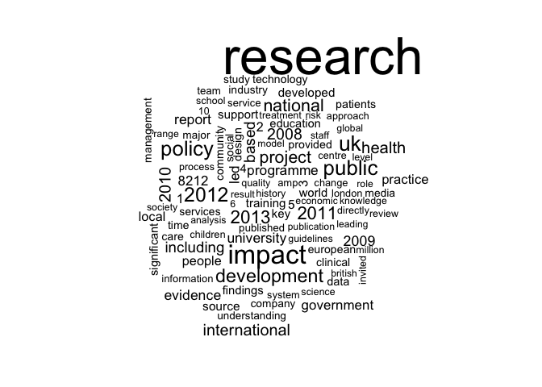
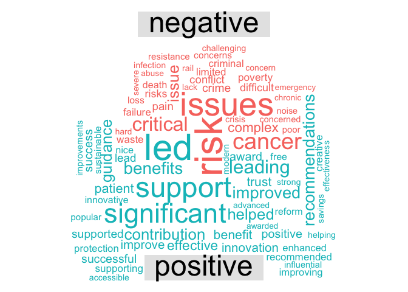

UK REF Impact Case Studies - Exploration
================

*This script explores the UK REF Impact Case Studies dataset. The dataset was previously extracted from <http://impact.ref.ac.uk/CaseStudies/> using the refimpact package (which was developed as part of this iLab project) and saved locally to allow for faster access.*

Preparation
-----------

``` r
library(dplyr)
library(tidytext)
library(ggplot2)
library(stringr)
library(wordcloud)
library(coreNLP)
library(tibble)
```

Selecting Data
--------------

Before getting started with analysis, we might as well take a look at some of the data. Firstly we will load it into memory and clean it up a little.

``` r
ref <- readRDS("~/ref_data.rds")
ref$Title <- 
  str_replace_all(ref$Title,                pattern = "[\\s]+", replace = " ")
ref$UnderpinningResearch <- 
  str_replace_all(ref$UnderpinningResearch, pattern = "[\\s]+", replace = " ")
ref$Sources <- 
  str_replace_all(ref$Sources,              pattern = "[\\s]+", replace = " ")
ref$References <- 
  str_replace_all(ref$References,           pattern = "[\\s]+", replace = " ")
ref$ImpactSummary <- 
  str_replace_all(ref$ImpactSummary,        pattern = "[\\s]+", replace = " ")
ref$ImpactDetails <- 
  str_replace_all(ref$ImpactDetails,        pattern = "[\\s]+", replace = " ")
```

There is a bunch of metadata to look at, but we're really interested in the text. There are multiple pieces of text in each record:

``` r
cat(paste(strwrap(ref$Title[1],                80), collapse="\n"))
```

    ## Influencing guidelines on management of hypertension following acute stroke

``` r
cat(paste(strwrap(ref$UnderpinningResearch[1], 80), collapse="\n"))
```

    ## Blood pressure abnormalities are common after acute stroke, and both
    ## hypertension and marked hypotension (high and low blood pressure) are
    ## associated with poor outcome. Stroke patients often have pre-existing
    ## hypertension (which is the most important risk factor for stroke, contributing
    ## to more than 50% of all strokes) which may or may not have been treated before
    ## the stroke. In these cases, there has been uncertainty as to whether usual
    ## antihypertensive treatments should be continued in the period immediately
    ## following the stroke. When stroke occurs, initial management is critical for
    ## the outcome of the disease as hypertension is associated with poor short-term
    ## and long-term outcomes. However, best practice for management of blood pressure
    ## in acute stroke has been uncertain because of a scarcity of data from which to
    ## draw evidence. Before our studies there was concern that continuing
    ## antihypertensive therapy would lower blood pressure and extend the stroke. Our
    ## studies have shown that antihypertensive therapy is not deleterious. Indeed the
    ## contrary is true as lowering blood pressure halves the 3-month mortality. Our
    ## research has involved two large, UK, multi-centre trials to investigate
    ## management of blood pressure following acute stroke: The CHHIPS (Controlling
    ## Hypertension and Hypotension Immediately Post-Stroke) trial assessed the
    ## feasibility, safety and effects of two antihypertensive drugs (labetalol and
    ## lisinopril) to lower blood pressure. CHHIPS was a randomised,
    ## placebo-controlled, double-blind trial. Patients were recruited at six centres
    ## in the UK from January 2005 to December 2007. Stroke patients (symptom onset
    ## within 36hr and systolic blood pressure above 160mmHg) were randomly assigned
    ## to receive either treatment or a matched placebo. In 179 patients, the primary
    ## outcome - death or dependency at 2 weeks - showed no difference between the
    ## active treatment and placebo groups. In addition, no neurological deterioration
    ## or serious adverse effects were found with active treatment, despite a
    ## significantly greater fall in systolic blood pressure within the first 24hr,
    ## compared to the placebo group. A striking result was that the 3-month mortality
    ## was halved in patients taking antihypertensives compared to the placebo group.
    ## The conclusion was that labetalol and lisinopril are effective antihypertensive
    ## drugs for acute stroke that do not increase serious adverse effects (research
    ## references 1 &amp; 2). A cost utility study performed at UEA by Dr Wilson and
    ## colleagues from the Health Economics unit at the Norwich Medical School and
    ## Professor Potter demonstrated that antihypertensive therapy in hypertensive
    ## patients immediately post stoke is both effective and cost-effective compared
    ## to placebo at 3 months after the stroke (research reference 3). The COSSACS
    ## (Continue Or Stop post-Stroke Antihypertensives Collaborative Study) trial
    ## assessed efficacy and safety of continuing or stopping pre-existing treatment
    ## with antihypertensive drugs in patients who had recently had a stroke. COSSACS
    ## was a single-blind randomised controlled trial. Patients were recruited at 49
    ## UK NIHR Stroke Research Network centres from January 2003 to March 2009. 763
    ## stroke patients (symptom onset within 48hr), who were currently taking
    ## antihypertensive drugs were randomly assigned to continue or stop the
    ## pre-existing treatment for a 2-week period. Clinicians, blinded to the group to
    ## which each patient belonged, assessed outcomes after two weeks and six weeks.
    ## No substantial differences were observed between the two groups in adverse
    ## events, 6-month mortality or major cardiovascular events. In addition, lower
    ## blood pressure levels in those who continued antihypertensive treatment were
    ## not associated with an increase in adverse effects. As hypertension is the
    ## major treatable risk factor for future stroke, continuation of antihypertensive
    ## in the immediate stroke period is safe and likely to improve long-term
    ## outcomes. The conclusion was that there is no obvious harm associated with
    ## continuing pre-existing antihypertensive drugs for a 2-week period following
    ## acute stroke (research reference 4). UEA researchers: John Potter: Professor
    ## Potter was the principal investigator, developed the trials, sought and
    ## obtained funding and was responsible for the overall running, analysis and
    ## writing of all manuscripts. The studies were initiated at the University of
    ## Leicester and continued at UEA since 2006. Since joining UEA, Professor Potter
    ## maintained a lead involvement in the studies. Significant patient recruitment
    ## and data collection continued, and analyses and dissemination was undertaken
    ## while at UEA. Edward Wilson: Lecturer in Health Economics at UEA 2003-2013.

``` r
cat(paste(strwrap(ref$Sources[1],              80), collapse="\n"))
```

    ## A. Guidelines for the Early Management of Patients With Acute Ischemic Stroke :
    ## A Guideline for Healthcare Professionals The American Heart
    ## Association/American Stroke Association Stroke 2013 44:870-947 doi:
    ## 10.1161/STR.0b013e318284056a References to UEA research: pp.890 &amp; p.891
    ## (their reference 411) and p.890 (their reference 433) B. Guidelines for the
    ## management of arterial hypertension The European Society of Hypertension and
    ## The European Society of Cardiology Eur Heart J 2013 34:2159-2219 doi:
    ## 10.1093/eurheartj/eht151 Reference to the CHHIPS study is made on p42 C.
    ## National clinical guideline for stroke Royal College of Physicians:
    ## Intercollegiate Stroke Working Party London, 2012
    ## www.rcplondon.ac.uk/sites/default/files/national-clinical-guidelines-for-stroke-fourth-edition.pdf
    ## Reference to UEA research: p54 - the CHHIPs study is cited as a source
    ## reference for recommendations I and J

``` r
cat(paste(strwrap(ref$References[1],           80), collapse="\n"))
```

    ## (UEA authors in bold) 1. Potter JF, Mistri A, Brodie F, Chernova J, Wilson E,
    ## Jagger C, James M, Ford G, Robinson T Controlling Hypertension and Hypotension
    ## Immediately Post Stroke (CHHIPS) - a randomised controlled trial Health
    ## Technology Assessment 2009 13:article no.9 doi: 10.3310/hta13090 2. Potter JF,
    ## Robinson TG, Ford GA, Mistri A, James M, Chernova J, Jagger C Controlling
    ## hypertension and hypotension immediately post-stroke (CHHIPS): a randomised,
    ## placebo-controlled, double-blind pilot trial Lancet Neurology 2009 8:48-56 doi:
    ## 10.1016/S1474-4422(08)70263-1 3. Wilson EC, Ford GA, Robinson T, Mistri A,
    ## Jagger C, Potter JF Controlling hypertension immediately post stroke: a cost
    ## utility analysis of a pilot randomised controlled trial. Cost effectiveness and
    ## resource allocation 2010 8:article no.3 doi: 10.1186/1478-7547-8-3 4. Robinson
    ## TG, Potter JF, Ford G, Bulpitt C, Chernova J, Jagger C, James M, Knight J,
    ## Markus H, Mistri AK, Poulter NR Effects of antihypertensive treatment after
    ## acute stroke in the Continue Or Stop post-Stroke Antihypertensives
    ## Collaborative Study (COSSACS): a prospective, randomised, open, blinded-
    ## endpoint trial. Lancet Neurology 2010 9:767-75 doi:
    ## 10.1016/S1474-4422(10)70163-0 Grant support: COSSACS: This study was funded
    ## with grants from The Health Foundation 2003-2009 (&#163;310,000) and The Stroke
    ## Association. Professor Potter developed the trial, sought and obtained funding,
    ## reviewed the analysis and revised the manuscript. CHHIPS: The trial was funded
    ## with a grant from the UK National Health Service Research and Development
    ## Health Technology Assessment Programme 2004-2008 (&#163;1.1M). Professor Potter
    ## was the principal investigator, developed the trial, sought and obtained
    ## funding and was responsible for the overall running, analysis and writing-up.

``` r
cat(paste(strwrap(ref$ImpactSummary[1],        80), collapse="\n"))
```

    ## Two multicentre clinical trials conducted by Professor Potter have contributed
    ## to revised international guidelines for the management of hypertension
    ## following acute stroke, the single largest cause of adult disability worldwide.
    ## Before these trials, there was little evidence on the effects of using
    ## antihypertensive drugs immediately after stroke and there was concern that use
    ## of these drugs could extend the stroke. The trials found no serious adverse
    ## effects of using antihypertensive drugs immediately after stroke whilst
    ## mortality after 3 months was halved. The American Heart Association, the
    ## European Societies of Hypertension and of Cardiology, and the Royal College of
    ## Physicians all reference these trials in support of their recent Guidelines,
    ## thereby promoting better patient care and improved outcomes.

``` r
cat(paste(strwrap(ref$ImpactDetails[1],        80), collapse="\n"))
```

    ## Each year, in England alone, approximately 152,000 people suffer a stroke. In
    ## the UK, 1 in 5 strokes are fatal. The annual costs of stroke in the UK are
    ## estimated to be between &#163;3.7 billion and &#163;8 billion and the majority
    ## of this cost is rehabilitation and supporting activities of daily living (e.g.
    ## bathing, dressing and feeding) after stroke. When stroke occurs, initial
    ## management is critical for the outcome of the disease. Hypertension is
    ## associated with poor short-term and long-term outcomes (see for example Annals
    ## Neurol 1998 24:258-263 or J Internal Med 2001 249:467-473). Hypertension is
    ## common after acute stroke, and is also a major risk factor for stroke. However,
    ## best practice for management of blood pressure in acute stroke has been
    ## uncertain because of a scarcity of data from which to draw evidence. This is a
    ## serious concern. The research described in this case study has been used to
    ## inform international guidelines on the management of hypertension following
    ## stroke, promoting better patient care with the goal of improving outcomes from
    ## stroke. The American Heart Association used the research outcomes from the
    ## CHHIPS and COSSACS studies to inform the 2013 `Guidelines for the Early
    ## Management of Patients With Acute Ischemic Stroke: A Guideline for Healthcare
    ## Professionals'. (corroborating source A) Both the CHHIPS study (their reference
    ## 411) and the COSSACS study (their ref 433) are cited in the text as supporting
    ## evidence for the following recommendations in the guidelines which acknowledge
    ## the important contribution these trials have made to this controversial field.
    ## Recommendation 2 (p892) states: "Patients who have elevated blood pressure and
    ## are otherwise eligible for treatment with intravenous rtPA should have their
    ## blood pressure carefully lowered (Table 9) so that their systolic blood
    ## pressure is &lt;185 mm Hg and their diastolic blood pressure is &lt;110 mm Hg
    ## (Class I; Level of Evidence B) before fibrinolytic therapy is initiated. If
    ## medications are given to lower blood pressure, the clinician should be sure
    ## that the blood pressure is stabilized at the lower level before beginning
    ## treatment with intravenous rtPA and maintained below 180/105 mm Hg for at least
    ## the first 24 hours after intravenous rtPA treatment." Specific reference to the
    ## COSSACS study is made in recommendation 10 (p893) which states: "Evidence from
    ## one clinical trial indicates that initiation of antihypertensive therapy within
    ## 24 hours of stroke is relatively safe. Restarting antihypertensive medications
    ## is reasonable after the first 24 hours for patients who have pre-existing
    ## hypertension and are neurologically stable unless a specific contraindication
    ## to restarting treatment is known (Class IIa; Level of Evidence B)." The 2013
    ## `Guidelines for the management of arterial hypertension' from the European
    ## Society of Hypertension and of the European Society of Cardiology
    ## (corroborating source B) state that blood pressure management during the acute
    ## phase of stroke is a matter of continuing concern, and that this is a difficult
    ## area. The CHHIPS study is used as evidence of a beneficial impact of
    ## administering lisinopril in patients with acute stroke and a systolic blood
    ## pressure&gt;160 mmHg. The 2012 Royal College of Physicians `National Clinical
    ## Guidelines for Stroke' (corroborating source C) advise that parenteral drugs
    ## for control of blood pressure should at present only be used as part of a
    ## clinical trial (apart from certain conditions relating to patients with very
    ## high blood pressure or in preparation for thrombolysis) and highlight the need
    ## for further research in blood pressure management in acute stroke, with
    ## reference to the CHHIPS study. As an additional approach to ensuring impact
    ## from the research, Potter has contributed to the preparation of clinical
    ## guidelines. For example, the 2008 guidelines from the Royal College of
    ## Physicians National Collaborating Centre for Chronic Conditions `Stroke:
    ## national clinical guideline for diagnosis and initial management of acute
    ## stroke and transient ischaemic attack (TIA)'.

There is a lot of information here, and a lot of future analysis for other iLab students! For me though, the objectives of the project are best served looking at the ImpactDetails column, as this has the largest body of text.

Exploration
-----------

The **unnest\_tokens()** function from the **tidytext** package is used to reshape the data into "tidy" format, which allows simple analysis using packages like **dplyr** and **ggplot2**.

``` r
tidy_ref <- unnest_tokens(tbl    = ref, 
                          output = word, 
                          input  = ImpactDetails)
```

It makes sense to remove stop words (common words like "a", "the", "is", etc) so that they don't swamp the analysis.

``` r
data("stop_words")
tidy_ref <- anti_join(tidy_ref, stop_words)
```

We can now make a count of the most frequent words in the dataset.

``` r
count(tidy_ref, word, sort = TRUE) 
```

    ## # A tibble: 114,363 × 2
    ##           word     n
    ##          <chr> <int>
    ## 1     research 45483
    ## 2       impact 20389
    ## 3           uk 15071
    ## 4       public 14530
    ## 5       policy 14395
    ## 6         2012 13719
    ## 7  development 12508
    ## 8         2013 11784
    ## 9         2011 11523
    ## 10    national 10996
    ## # ... with 114,353 more rows

The results are entirely unsurprising! We can drill down further by using positive and negative sentiment labels; the example below uses the Canadian National Research Council (NRC) crowdsourced lexicon, obtained through the **tidytext** package.

``` r
# Positive sentiment
nrcpos <- filter(sentiments, lexicon == "nrc", sentiment == "positive")
tidy_ref %>%
  semi_join(nrcpos) %>%
  count(word, sort = TRUE)
```

    ## # A tibble: 1,948 × 2
    ##             word     n
    ##            <chr> <int>
    ## 1         public 14530
    ## 2      including  8695
    ## 3     university  7734
    ## 4       practice  7007
    ## 5     technology  5040
    ## 6      community  4950
    ## 7          study  4686
    ## 8     management  4641
    ## 9          major  4526
    ## 10 understanding  4489
    ## # ... with 1,938 more rows

``` r
# Negative sentiment
nrcneg <- filter(sentiments, lexicon == "nrc", sentiment == "negative")
tidy_ref %>%
  semi_join(nrcneg) %>%
  count(word, sort = TRUE)
```

    ## # A tibble: 2,287 × 2
    ##            word     n
    ##           <chr> <int>
    ## 1    government  7243
    ## 2          risk  3653
    ## 3     influence  2236
    ## 4       disease  2025
    ## 5        cancer  1951
    ## 6       subject  1157
    ## 7  intervention  1144
    ## 8        scheme   942
    ## 9        stroke   918
    ## 10   regulatory   876
    ## # ... with 2,277 more rows

We can also look at which words are contributing most strongly to sentiment. This will use Bing Liu's lexicon (University of Illinois at Chicago) to score words as positive or negative, and then select the most frequently appearing words for plotting.

``` r
bing <- filter(sentiments, lexicon == "bing") %>% select(-score)
bing_word_counts <- tidy_ref %>%
  inner_join(bing) %>%
  count(word, sentiment, sort = TRUE) %>%
  ungroup()

# Plot sentiment word importance
bing_word_counts %>%
  filter(n > 1000) %>%
  mutate(n = ifelse(sentiment == "negative", -n, n)) %>%
  mutate(word = reorder(word, n)) %>%
  ggplot(aes(word, n, fill = sentiment)) +
  geom_bar(stat = "identity") +
  theme(axis.text.x = element_text(angle = 90, hjust = 1)) +
  ylab("Contribution to sentiment")
```


We can also use visualisation techniques like wordclouds to analyse these word distributions.

``` r
library(wordcloud)
tidy_ref %>%
  count(word) %>%
  with(wordcloud(word, n, max.words = 100))
```



You can also use comparative wordclouds to compare different sentimental words.

``` r
library(reshape2)
tidy_ref %>%
  inner_join(bing) %>%
  count(word, sentiment, sort = TRUE) %>%
  acast(word ~ sentiment, value.var = "n", fill = 0) %>%
  comparison.cloud(colors = c("#F8766D", "#00BFC4"),
                   max.words = 80)
```



### Natural Language Processing

The obvious next step is to look at the average sentiment of each sentence, look at which institutions are being more positive or more negative, but that's all a bit boring and doesn't really help with the iLab. So let's skip straight ahead to the nail-with-a-sledgehammer approach and use the **coreNLP** package to analyse an entire document. CoreNLP can deal with the data in its native format (i.e. without tokenisation) so we can jump straight into it.

Note that this is not worth running if you have less than 16GB memory in your computer, and even then it might set it on fire with the heat your computer will generate. Given how slowly this runs, I will limit the analysis to a single case study (the same as the one at the top of this document).

``` r
initCoreNLP(mem="8g", 
            parameterFile = "~/impactface/Experimentation/corenlp.properties")
annoObj <- annotateString(ref$ImpactDetails[1])
as_tibble(annoObj$token)
```

    ## # A tibble: 709 × 9
    ##    sentence    id         token         lemma CharacterOffsetBegin
    ## *     <int> <chr>         <chr>         <chr>                <int>
    ## 1         1     1          Each          each                    1
    ## 2         1     2          year          year                    6
    ## 3         1     3             ,             ,                   10
    ## 4         1     4            in            in                   12
    ## 5         1     5       England       England                   15
    ## 6         1     6         alone         alone                   23
    ## 7         1     7             ,             ,                   28
    ## 8         1     8 approximately approximately                   30
    ## 9         1     9       152,000       152,000                   44
    ## 10        1    10        people        people                   52
    ## # ... with 699 more rows, and 4 more variables: CharacterOffsetEnd <int>,
    ## #   POS <chr>, NER <chr>, Speaker <lgl>

``` r
as_tibble(annoObj$sentiment)
```

    ## # A tibble: 20 × 3
    ##       id sentimentValue sentiment
    ## *  <int>          <int>     <chr>
    ## 1      1              1  Negative
    ## 2      2              1  Negative
    ## 3      3              1  Negative
    ## 4      4              1  Negative
    ## 5      5              1  Negative
    ## 6      6              1  Negative
    ## 7      7              2   Neutral
    ## 8      8              3  Positive
    ## 9      9              1  Negative
    ## 10    10              1  Negative
    ## 11    11              1  Negative
    ## 12    12              1  Negative
    ## 13    13              1  Negative
    ## 14    14              1  Negative
    ## 15    15              1  Negative
    ## 16    16              1  Negative
    ## 17    17              1  Negative
    ## 18    18              1  Negative
    ## 19    19              3  Positive
    ## 20    20              1  Negative

This is really slow to run, so it is probably not suitable for analysis of bulk text.
