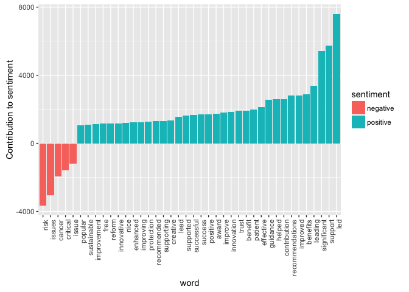

UK REF Impact Case Studies - Exploration
================
Perry Stephenson
09/10/2016

*This script explores the UK REF Impact Case Studies dataset. The dataset was previously extracted from <http://impact.ref.ac.uk/CaseStudies/> using the **refimpact** package, which was developed as part of this iLab project.*

Preparation
-----------

This analysis requires the **dplyr**, **tidytext** and **ggplot2** packages.

``` r
library(dplyr)
library(tidytext)
library(ggplot2)
```

Exploration
-----------

The data was previously extracted and saved locally. The **unnest\_tokens()** function from the **tidytext** package is used to reshape the data into "tidy" format, which allows simple analysis using packages like **dplyr** and **ggplot2**.

``` r
ref <- readRDS("~/ref_data.rds")
tidy_ref <- unnest_tokens(tbl = ref, 
                          output = word, 
                          input = ImpactDetails)
```

It makes sense to remove stop words (common words like "a", "the", "is", etc) so that they don't swamp the analysis.

``` r
data("stop_words")
tidy_ref <- anti_join(tidy_ref, stop_words)
```

We can now make a count of the most frequent words in the dataset.

``` r
count(tidy_ref, word, sort = TRUE) 
```

    ## # A tibble: 114,363 × 2
    ##           word     n
    ##          <chr> <int>
    ## 1     research 45483
    ## 2       impact 20389
    ## 3           uk 15071
    ## 4       public 14530
    ## 5       policy 14395
    ## 6         2012 13719
    ## 7  development 12508
    ## 8         2013 11784
    ## 9         2011 11523
    ## 10    national 10996
    ## # ... with 114,353 more rows

The results are entirely unsurprising! We can drill down further by using positive and negative sentiment labels; the example below uses the Canadian National Research Council (NRC) crowdsourced lexicon, obtained through the **tidytext** package.

``` r
# Positive sentiment
nrcpos <- filter(sentiments, lexicon == "nrc", sentiment == "positive")
tidy_ref %>%
  semi_join(nrcpos) %>%
  count(word, sort = TRUE)
```

    ## # A tibble: 1,948 × 2
    ##             word     n
    ##            <chr> <int>
    ## 1         public 14530
    ## 2      including  8695
    ## 3     university  7734
    ## 4       practice  7007
    ## 5     technology  5040
    ## 6      community  4950
    ## 7          study  4686
    ## 8     management  4641
    ## 9          major  4526
    ## 10 understanding  4489
    ## # ... with 1,938 more rows

``` r
# Negative sentiment
nrcneg <- filter(sentiments, lexicon == "nrc", sentiment == "negative")
tidy_ref %>%
  semi_join(nrcneg) %>%
  count(word, sort = TRUE)
```

    ## # A tibble: 2,287 × 2
    ##            word     n
    ##           <chr> <int>
    ## 1    government  7243
    ## 2          risk  3653
    ## 3     influence  2236
    ## 4       disease  2025
    ## 5        cancer  1951
    ## 6       subject  1157
    ## 7  intervention  1144
    ## 8        scheme   942
    ## 9        stroke   918
    ## 10   regulatory   876
    ## # ... with 2,277 more rows

We can also look at which words are contributing most strongly to sentiment. This will use Bing Liu's lexicon (University of Illinois at Chicago) to score words as positive or negative, and then select the most frequently appearing words for plotting.

``` r
bing <- filter(sentiments, lexicon == "bing") %>% select(-score)
bing_word_counts <- tidy_ref %>%
  inner_join(bing) %>%
  count(word, sentiment, sort = TRUE) %>%
  ungroup()

# Plot sentiment word importance
bing_word_counts %>%
  filter(n > 1000) %>%
  mutate(n = ifelse(sentiment == "negative", -n, n)) %>%
  mutate(word = reorder(word, n)) %>%
  ggplot(aes(word, n, fill = sentiment)) +
  geom_bar(stat = "identity") +
  theme(axis.text.x = element_text(angle = 90, hjust = 1)) +
  ylab("Contribution to sentiment")
```


