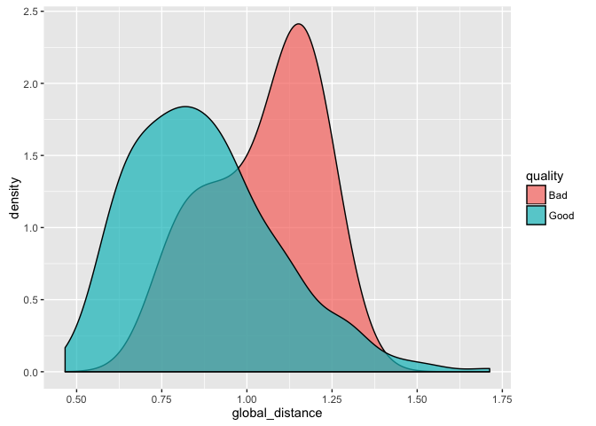
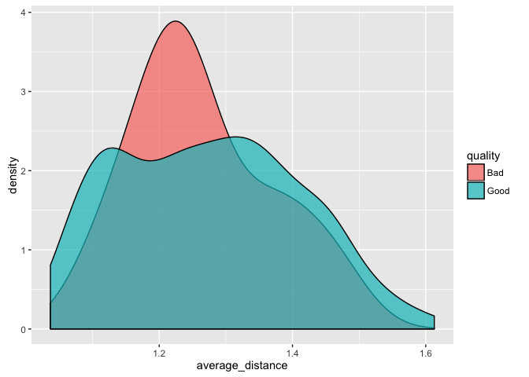
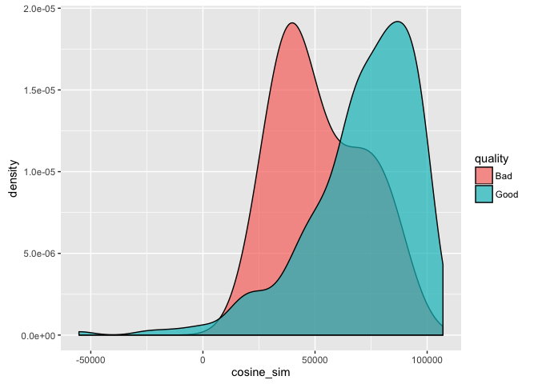

Implementation
================

This document will string together each of the key implementation steps and demonstrate the effectiveness of the end-to-end system as a static analysis. Some of the implementation is inside functions in the "Functions" folder of this repository, which is being developed to allow the code to be easily re-used in the event I get time to build a live demonstration system. These functions should also minimise the time-to-implementation for anyone wishing to apply this technique to a new dataset.

Setup and Packages
------------------

``` r
root <- path.expand("~/impactface/")
set.seed(2016L)
library(dplyr)
library(ggplot2)
library(magrittr)
library(refimpact)
library(stringr)
library(text2vec)
library(tibble)
library(tidytext)
```

Data Import
-----------

The data will be either imported from an RDS file on disk, or directly from the REF Impact Case Study Database using the `refimpact` package. We will also do some very basic cleaning by removing superfluous whitespace from the text fields.

``` r
source(paste0(root, "Functions/load_ref_data.R"))
ref <- load_ref_data() %>% 
  select(CaseStudyId, UOA, ImpactType, Institution, Title, ImpactDetails)
in_test <- sample(1:nrow(ref), 10)
test <- ref[ in_test, ] # Leave 10 out for testing
ref  <- ref[-in_test, ] # Keep the rest
ref$Institution %<>%   str_replace_all("\\s+", " ") %>% 
                       str_replace_all("(^\\s+)|(\\s+$)", "")
ref$Title %<>%         str_replace_all("\\s+", " ") %>% 
                       str_replace_all("(^\\s+)|(\\s+$)", "")
ref$ImpactDetails %<>% str_replace_all("\\s+", " ") %>% 
                       str_replace_all("(^\\s+)|(\\s+$)", "")
glimpse(ref)
```

    ## Observations: 6,627
    ## Variables: 6
    ## $ CaseStudyId   <chr> "1855", "1856", "2582", "2613", "2703", "2728", ...
    ## $ UOA           <chr> "Clinical Medicine", "Clinical Medicine", "Clini...
    ## $ ImpactType    <chr> "Health", "Technological", "Health", "Health", "...
    ## $ Institution   <chr> "University of East Anglia", "University of East...
    ## $ Title         <chr> "Influencing guidelines on management of hyperte...
    ## $ ImpactDetails <chr> "Each year, in England alone, approximately 152,...

If you are confused by the use of the `%<>%` operator (from the **magrittr** package) then you should call `?'%<>%'` to learn more about it!

Tidy Text
---------

The basic unit of analysis in this project is the sentence, so we will need to break down the text into sentences for later analysis. We can do this using the `tidytext` package.

``` r
tidy_ref <- unnest_tokens(ref, Sentence, ImpactDetails, "sentences", to_lower=F)
glimpse(tidy_ref)
```

    ## Observations: 210,972
    ## Variables: 6
    ## $ CaseStudyId <chr> "100", "100", "100", "100", "100", "100", "100", "...
    ## $ UOA         <chr> "Architecture, Built Environment and Planning", "A...
    ## $ ImpactType  <chr> "Cultural", "Cultural", "Cultural", "Cultural", "C...
    ## $ Institution <chr> "Nottingham Trent University", "Nottingham Trent U...
    ## $ Title       <chr> "Managing heritage, designing futures: heritage do...
    ## $ Sentence    <chr> "The historical, cultural, methodological and ethi...

Fit a GloVe Model
-----------------

In Tuning.Rmd I tried 4 different values of dimensions and 4 different values of window length. In general, higher values of both seem to improve the ability of the GloVe model to score higher on the standard test set, however changing the values of these values doesn't seem to influence the identification of outliers. According to some irresponsibly quick reading of Google search results, the following statements are broadly reasonable:

1.  Higher-dimension models are more likely to capture meaningful relationships
2.  Larger skip-gram windows are more likely to capture meaningful relationsips

However, larger skip-gram windows also mean that the model will favour document-level word context over sentence-level word context. Given that future analysis in this project will be focused on sentences, I think that it makes sense to choose a moderate dimension (75) and a relatively small skip-window (5).

``` r
source(paste0(root, "Functions/fit_glove_model.R"))
tmp <- fit_glove_model(ref$ImpactDetails, 75, 5) 
glove <- tmp[[1]]
vocab <- tmp[[2]]
rm(tmp)
word_vectors <- glove$get_word_vectors()
```

Locate Sentences in GloVe Representation
----------------------------------------

We will be applying a tfidf transform (and we will need to reapply this transform later) so the tfidf model object is fit to the data prior to being passed into the function.

``` r
source(paste0(root, "Functions/fit_tfidf.R"))
tfidf <- fit_tfidf(tidy_ref$Sentence, vocab)
source(paste0(root, "Functions/get_sentence_vectors.R"))
sentence_vectors <- get_sentence_vectors(sentences = tidy_ref$Sentence, 
                                         vocab = vocab, 
                                         transform = tfidf, 
                                         wv = word_vectors)
```

Import Unseen Data and Identify Outliers
----------------------------------------

Ten impact case studies were kept out of the training data to allow testing on unseen data. Each of these 10 case studies will have a new sentence added to the ImpactDetails field, and these sentences will be intentionally unsuitable for inclusion in an impact case study.

``` r
source(paste0(root, "Functions/add_bad_sentences.R"))
test <- add_bad_sentences(test)
```

Ordinarily these unseen documents would be analysed individually, however for the purposes of demonstration we will consider all 10 documents at once. To do this we need to clean up the text by removing whitespace, and then break the documents down into individual sentences.

``` r
test$Institution %<>%   str_replace_all("\\s+", " ") %>% 
                       str_replace_all("(^\\s+)|(\\s+$)", "")
test$Title %<>%         str_replace_all("\\s+", " ") %>% 
                       str_replace_all("(^\\s+)|(\\s+$)", "")
test$ImpactDetails %<>% str_replace_all("\\s+", " ") %>% 
                       str_replace_all("(^\\s+)|(\\s+$)", "")
tidy_test <- unnest_tokens(test, Sentence, ImpactDetails, "sentences", to_lower=F)
```

We can now calculate the vector representation of each of these unseen sentences using the pre-discovered vocabulary, the pre-trained GloVe model and the pre-trained tfidf transformation.

``` r
unseen_vectors <- get_sentence_vectors(sentences = tidy_test$Sentence, 
                                         vocab = vocab, 
                                         transform = tfidf, 
                                         wv = word_vectors)
```

We can now try and find those 10 "bad" sentences automatically using euclidean distances in the GloVe model space.

### Average Sentence Approach

This approach calculates the distance from each sentence to the "average sentence" from the training corpus. The average sentence is quite close to zero, so this could also be achieved by calculating each sentence vector length in the GloVe vector space.

``` r
average_sentence <- colMeans(as.matrix(sentence_vectors))
tidy_test$global_distance <- 
  dist2(x = as.matrix(unseen_vectors), y = t(as.matrix(average_sentence)), 
       method = "euclidean", norm = "l2")[,1]
tidy_test %>% arrange(desc(global_distance)) %>%
  select(Sentence) %>%
  head(10)
```

    ## # A tibble: 10 × 1
    ##                                                                       Sentence
    ##                                                                          <chr>
    ## 1                                                     Autoimmune encephalitis.
    ## 2                                                                        108].
    ## 3  For instance, when discussing dosing and augmentation of clozapine, use of 
    ## 4  Autoimmune Disorders (VGKC-complex proteins, LGI1, CASPR2, contactin-2) PCT
    ## 5  Furthermore products must meet strict government legalisation and Christine
    ## 6  For example, Taylor 2009a is used throughout when considering clozapine aug
    ## 7  Torture Team research successfully challenged the narrative of the US admin
    ## 8  The two standard treatments for myasthenia gravis are anticholinesterase dr
    ## 9  Examples of industrial members are Pfizer, Johnson Matthey and Procter &amp
    ## 10 The review cites a Vincent group paper (Irani et al., 2010b) as evidence fo

This approach is not working well!

### Average Distance Approach

Instead of calculating the distance from the average, we can calculate the average distance from the other sentences.

``` r
distances <- 
  dist2(x = as.matrix(unseen_vectors), y = as.matrix(sentence_vectors), 
       method = "euclidean", norm = "l2")
tidy_test$average_distance <- rowMeans(distances)
rm(distances)
tidy_test %>% arrange(desc(average_distance)) %>%
  select(Sentence) %>%
  head(10)
```

    ## # A tibble: 10 × 1
    ##                                                                       Sentence
    ##                                                                          <chr>
    ## 1                                                     Autoimmune encephalitis.
    ## 2                                                                        108].
    ## 3  For instance, when discussing dosing and augmentation of clozapine, use of 
    ## 4  Autoimmune Disorders (VGKC-complex proteins, LGI1, CASPR2, contactin-2) PCT
    ## 5  Furthermore products must meet strict government legalisation and Christine
    ## 6  For example, Taylor 2009a is used throughout when considering clozapine aug
    ## 7  Torture Team research successfully challenged the narrative of the US admin
    ## 8  The two standard treatments for myasthenia gravis are anticholinesterase dr
    ## 9  Examples of industrial members are Pfizer, Johnson Matthey and Procter &amp
    ## 10 The review cites a Vincent group paper (Irani et al., 2010b) as evidence fo

This is also not ideal, and is clearly not working very well.

### Cosine Similarity

``` r
similarity <- 
  sim2(x = as.matrix(unseen_vectors), y = as.matrix(sentence_vectors), 
       method = "cosine", norm = "l2")
tidy_test$cosine_sim <- rowSums(similarity)
tidy_test %>% arrange(cosine_sim) %>%
  select(Sentence) %>%
  head(10)
```

    ## # A tibble: 10 × 1
    ##                                                                       Sentence
    ##                                                                          <chr>
    ## 1                                                     Autoimmune encephalitis.
    ## 2                                                                        108].
    ## 3  For instance, when discussing dosing and augmentation of clozapine, use of 
    ## 4  Autoimmune Disorders (VGKC-complex proteins, LGI1, CASPR2, contactin-2) PCT
    ## 5  Furthermore products must meet strict government legalisation and Christine
    ## 6  For example, Taylor 2009a is used throughout when considering clozapine aug
    ## 7  Torture Team research successfully challenged the narrative of the US admin
    ## 8  The two standard treatments for myasthenia gravis are anticholinesterase dr
    ## 9  Examples of industrial members are Pfizer, Johnson Matthey and Procter &amp
    ## 10 The review cites a Vincent group paper (Irani et al., 2010b) as evidence fo

``` r
tidy_test$quality <- "Good"
# Get the final sentence in each case study and label it as "Bad"
case_studies <- unique(tidy_test$CaseStudyId)
rows <- c(1:10) # Dummy values
for (i in 1:10) {
  rows[i] <- max(which(tidy_test$CaseStudyId == case_studies[i]))
}
tidy_test$quality[rows] <- "Bad"
rm(rows)
# Plot some distributions
ggplot(tidy_test) + 
  geom_density(aes(x=global_distance, fill=quality), alpha=0.7)
```



``` r
ggplot(tidy_test) + 
  geom_density(aes(x=average_distance, fill=quality), alpha=0.7)
```



``` r
ggplot(tidy_test) + 
  geom_density(aes(x=cosine_sim, fill=quality), alpha=0.7)
```



These metrics are definitely useful, but they aren't perfect.

Sentence Replacement Suggestions
--------------------------------

The next key component is the suggestion of replacement sentences. For the development of this component I will be using the "known bad" sentences, i.e. the sentences which I used to vandalise the otherwise well-written impact case studies.

``` r
replacement_candidates <- tidy_test$Sentence[tidy_test$quality == "Bad"]
```

We will use the Relaxed Word Mover's Distance exclusively for this part of the project given how well it worked in the experimentation phase.

``` r
tokens <- 
  tidy_ref$Sentence %>% 
  str_to_lower() %>% 
  str_replace_all("[^[:alnum:]]", " ") %>% 
  str_replace_all("\\s+", " ") %>% 
  str_replace_all("(^\\s+)|(\\s+$)", "") %>% 
  word_tokenizer()
it <- itoken(tokens)
vectorizer <- vocab_vectorizer(vocab)
dtm <- create_dtm(it, vectorizer)

tokens <- 
  tidy_test$Sentence %>% 
  str_to_lower() %>% 
  str_replace_all("[^[:alnum:]]", " ") %>% 
  str_replace_all("\\s+", " ") %>% 
  str_replace_all("(^\\s+)|(\\s+$)", "") %>% 
  word_tokenizer()
it <- itoken(tokens)
vectorizer <- vocab_vectorizer(vocab)
unseen_dtm <- create_dtm(it, vectorizer)

for (i in seq_along(replacement_candidates)) {
  message("Sentence being analysed:")
  cat(replacement_candidates[i])
  
  tokens <- 
    replacement_candidates[i] %>% 
    str_to_lower() %>% 
    str_replace_all("[^[:alnum:]]", " ") %>% 
    str_replace_all("\\s+", " ") %>% 
    str_replace_all("(^\\s+)|(\\s+$)", "") %>% 
    word_tokenizer()
  it <- itoken(tokens)
  vectorizer <- vocab_vectorizer(vocab)
  unseen_dtm <- create_dtm(it, vectorizer)

  rwmd <- RelaxedWordMoversDistance$new(word_vectors)
  rwmd$verbose <- FALSE
  tidy_ref$rwmd_distance <- dist2(dtm, unseen_dtm, 
                                  method = rwmd, 
                                  norm = "none")[,1]
  suggestions <- tidy_ref %>% 
    arrange(rwmd_distance) %>% 
    head(3)
  
  message("Similar sentences from the corpus:")
  print(suggestions$Sentence)
}
```

    ## Sentence being analysed:

    ## We tried to do something different to what everyone else was doing.

    ## Similar sentences from the corpus:

    ## [1] "Surely that is something that we all want to support.\""    
    ## [2] "I can't think of anything else you could use to do it' [c]."
    ## [3] "She felt she was doing something to help herself...\""

    ## Sentence being analysed:

    ## This project awesome and people in Australia and America said it was awesome.

    ## Similar sentences from the corpus:

    ## [1] "It has also been broadcast on BBC2 and in Australia, South Africa, Canada and the United States."
    ## [2] "It was also widely reviewed in Canada, Australia and the United States."                         
    ## [3] "This was granted in USA in 2012 and is currently under examination in Europe."

    ## Sentence being analysed:

    ## The university got lots of money from the government and from IBM and Microsoft.

    ## Similar sentences from the corpus:

    ## [1] "Many of the visitors were schoolchildren drawn in by the education projects, along with students from the University of Brighton and the University of Sussex."                                                                                                                                                                                                                             
    ## [2] "The cast and crew of both, as well as the website team for the second, were drawn from the staff and students of the Department of Theatre, Film and Television."                                                                                                                                                                                                                           
    ## [3] "The testimonials also revealed that the work of Dr Stibbe has been drawn from and incorporated into the curriculum at the University of York, Nottingham University, Greenwich University, South Downs College, London South Bank University, Ball State University, the University of Graz, the University of Modena, the University of New Mexico, and Luxemburg University among others."

    ## Sentence being analysed:

    ## Every year many people get sick kidneys and it makes them die.

    ## Similar sentences from the corpus:

    ## [1] "I know that some of this year's students also used them in school on their practices and found them appropriate and very useful' [C10]."                         
    ## [2] "The ultimate beneficiaries of the research are 57,000 children and young people (and increasingly many adults) in Hull, and professionals working with them."    
    ## [3] "The nature of the impact It is demonstrable that many people found this this material rewarding, and that many of them were moved to pursue the subject further."

    ## Sentence being analysed:

    ## Everyone was sick at the start and now they are not sick at the end.

    ## Similar sentences from the corpus:

    ## [1] "The DVD Only Connect was published at the very end of the assessment period, and sales figures are not yet available."       
    ## [2] "At the project's end participants were asked to report how easy they found the exercise and how often they had completed it."
    ## [3] "I was at the front, looking to do damage and not caring."

    ## Sentence being analysed:

    ## We got our project in the local newspaper and on television and everyone watched.

    ## Similar sentences from the corpus:

    ## [1] "The conference on the Frisian tablet also generated local and national newspaper and television reports."                                                                                 
    ## [2] "The project, and the successful launch of the boat in April 2013, were reported by the BBC and ITV in extended reports on national and local television and radio (e.g."                  
    ## [3] "The Centre prides itself on its engagement in mainstream and peer reviewed journals and through presentations, conferences and on television and radio programmes and newspaper articles."

    ## Sentence being analysed:

    ## Lots of people were dying at the start and now less people are dying because of our project.

    ## Similar sentences from the corpus:

    ## [1] "Patients are less likely to be fluid overloaded now than they were at the beginning of the 21st century."                                                                                                  
    ## [2] "The government people are working more cautiously because of this.'"                                                                                                                                       
    ## [3] "Professional guidelines and training have been informed by the research and health outcomes have improved because of the availability of the new systems and the new ways that people are trained on them."

    ## Sentence being analysed:

    ## We came up with a new way of doing things that was better than the old way.

    ## Similar sentences from the corpus:

    ## [1] "As a result the new galleries adopted a chronological approach that opens `up the history of making and using objects in a way that reflects ..."
    ## [2] "For a fund that was less than one year old at the time, this demonstrates the quality of its proposition [7]."                                   
    ## [3] "In doing so, it has informed individuals by equipping them with a better understanding of the nature of the Templars."

    ## Sentence being analysed:

    ## We made friends and worked with people from the psychology department and the computer science department.

    ## Similar sentences from the corpus:

    ## [1] "Specifically, the collaboration examined the impact of our brain-computer research on public perceptions and engagement with science and society."
    ## [2] "Cooper worked with the team from the Department of Informatics at the University of Sussex who created the virtual graphics."                     
    ## [3] "The Bradford project also received funding from the Innovation, Excellence and Strategic Development Fund (IESD) from the Department of Health."

    ## Sentence being analysed:

    ## We worked with IBM and Microsoft and Apple and Google and lots of other companies.

    ## Similar sentences from the corpus:

    ## [1] "We have worked with most of the major industry players, and many minor ones."          
    ## [2] "The other companies listed are distribution and marketing companies with global reach."
    ## [3] "Microsoft has engaged heavily with the University of Southampton and Dezineforce."
